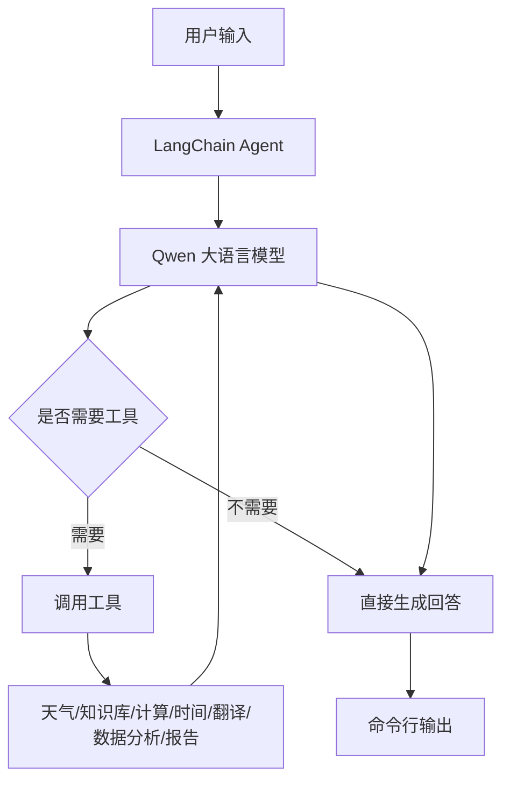

# LangChain Agent 基础

面向刚接触 AI Agent 开发的初学者。本课件从「模型 → 提示词 → 工具 → Agent」四层关系讲起,配套一个用 LangChain 和通义千问 Qwen 做的中文智能助手示例项目。

配套原始资料(课堂 PPT、示例代码)见本页附件区,可下载或预览。

## 这个项目学什么 {#overview}

这个项目用 LangChain 和通义千问 Qwen 做了一个中文智能助手。它不是只调用一次大模型,而是让大模型能够根据用户问题自动选择工具,例如查天气、查知识库、做数学计算、查时间、翻译、分析数据和生成报告。

你可以把它理解成一个「会用工具的聊天机器人」。普通聊天机器人只能根据模型已有知识回答,而 Agent 可以先判断「我需要调用哪个工具」,再拿工具返回的结果组织最终回答。

学完这个项目,你应该能理解:

- 什么是 Prompt,为什么提示词会影响模型行为。
- 什么是 Tool,为什么工具描述很重要。
- 什么是 Agent,Agent 如何决定调用工具。
- LangChain 的 `create_agent` 怎么使用。
- 如何把多个工具组合进一个智能助手。
- 如何做命令行交互、对话记忆、流式输出和异常处理。

## 项目文件说明 {#files}

项目主要有四个 Python 文件:

| 文件 | 作用 | 适合学习阶段 |
| --- | --- | --- |
| `langchain_prompt.py` | 演示 PromptTemplate、ChatPromptTemplate、Few-shot 等提示词模板 | 第一步 |
| `langchain_tools.py` | 演示如何定义工具、调用工具、把工具绑定给模型 | 第二步 |
| `langchain_agent.py` | 使用 `create_agent` 创建一个简单 Agent | 第三步 |
| `lanchain_Intelligent_assistant.py` | 综合版智能助手,包含多工具、记忆、流式输出、交互模式 | 第四步 |

建议学习顺序就是上面这个顺序。先理解提示词,再理解工具,最后理解 Agent。

## 核心概念:LLM {#concept-llm}

LLM 是 Large Language Model,大语言模型。项目里用的是通义千问 Qwen,通过 LangChain 的 `ChatTongyi` 调用。

在代码里通常是这样初始化的:

```python
llm = ChatTongyi(
    model="qwen-plus",
    temperature=0.7,
    dashscope_api_key=os.environ.get("DASHSCOPE_API_KEY")
)
```

几个参数的意思:

- `model`:使用哪个模型,例如 `qwen-plus`、`qwen-turbo`。
- `temperature`:控制回答随机性。越低越稳定,越高越发散。
- `dashscope_api_key`:调用模型服务需要的 API Key。

## 核心概念:Prompt {#concept-prompt}

Prompt 就是给模型的指令。它可以是简单字符串,也可以是带变量的模板。

比如:

```python
PromptTemplate.from_template(
    "请用{language}语言介绍一下{topic},不超过100字。"
)
```

这相当于给模型准备了一个可复用模板。运行时只需要填入 `language="中文"`、`topic="人工智能"`,最终得到「请用中文语言介绍一下人工智能,不超过100字。」

Prompt 的价值是把「每次都要重复写的指令」封装起来,让模型输出更稳定。

## 核心概念:Tool {#concept-tool}

Tool 是模型可以调用的外部能力。比如模型本身不会真正查天气,但你可以写一个天气查询函数,并把它注册成工具。

项目里用 `@tool` 装饰器定义工具:

```python
@tool
def get_weather(city: str) -> str:
    """获取指定城市的天气信息

    Args:
        city: 城市名称,如"北京"、"上海"
    """
    weather_db = {
        "北京": "晴天,温度15-25度,空气质量优",
        "上海": "多云,温度18-28度"
    }
    return weather_db.get(city, f"{city}的天气信息暂不可用")
```

这里有三个重点:

- 函数名要清楚,比如 `get_weather`。
- 参数类型要明确,比如 `city: str`。
- docstring 要写清楚用途和参数,因为模型会根据工具描述决定是否调用它。

## 核心概念:Agent {#concept-agent}

Agent 是「模型加工具加决策循环」。

一个普通模型调用流程是:`用户问题 -> 大模型 -> 回答`。

Agent 的流程是:`用户问题 -> 大模型判断是否需要工具 -> 调用工具 -> 获取工具结果 -> 大模型组织最终回答`。

所以 Agent 的关键不是「能聊天」,而是「能决定下一步做什么」。

## 核心概念:Memory {#concept-memory}

Memory 是对话记忆。没有记忆时,每次调用模型都像新对话。启用记忆后,模型可以知道前面聊过什么。

项目综合助手里使用了 `MemorySaver`:

```python
from langgraph.checkpoint.memory import MemorySaver

checkpointer = MemorySaver()

agent = create_agent(
    model=llm,
    tools=TOOLS,
    system_prompt=SYSTEM_PROMPT,
    checkpointer=checkpointer
)
```

调用时还需要配置 `thread_id`:

```python
config = {"configurable": {"thread_id": "main_session"}}
```

这样不同会话可以用不同的线程 ID 隔离上下文。

## 整体架构 {#architecture}



这个架构里,Agent 是中间调度者。用户并不直接调用工具,工具也不直接回答用户,而是由大模型根据问题选择工具。

## 创建最小 Agent {#minimal-agent}

`langchain_agent.py` 演示最基础的 Agent 创建方式。

核心代码:

```python
agent = create_agent(
    model=llm,
    tools=[get_weather, search_knowledge, calculator],
    system_prompt="你是一个专业的中文助手。仔细分析用户问题,选择合适的工具来回答。"
)
```

这里有三个核心组件:

- `model`:负责理解和生成。
- `tools`:提供外部能力。
- `system_prompt`:规定助手角色和行为规则。

调用 Agent 并读取最终回答:

```python
result = agent.invoke({
    "messages": [{"role": "user", "content": query}]
})
final_message = result["messages"][-1]
print(final_message.content)
```

返回结果是一个消息列表,最后一条通常是助手最终回答。这个文件适合理解 Agent 的最小闭环。

## 系统提示词怎么写 {#system-prompt}

如果不写系统提示词,模型可能不知道自己叫什么、可以做什么、什么时候该用工具、回答风格是什么、工具失败时怎么办。

写系统提示词时建议包含五部分:

```text
角色:你是谁
能力:你会什么
流程:你如何工作
边界:你不能做什么
风格:你怎么回答
```

这不是为了好看,而是为了降低模型误判、乱用工具、格式不一致的问题。

## 流式输出 {#streaming}

项目里使用 `agent.stream(...)` 实现边生成边显示:

```python
for chunk in agent.stream(inputs, config, stream_mode="values"):
    ...
```

流式输出的体验是模型边生成边显示,而不是等完整答案生成后一次性输出。它的挑战是:每个 chunk 里可能不一定有消息;要判断最后一条消息是不是 AI 消息;要避免重复打印已经输出过的内容。项目里用 `final_response` 记录已输出内容,再打印新增部分,这是一个实用技巧。

## 常见问题与排查 {#troubleshooting}

**模型没有调用工具**:可能是工具 docstring 写得不清楚、用户问题没有明显触发工具、系统提示词没有要求模型优先使用工具。解决方式是把工具描述写得更具体,并在系统提示词里说明「遇到天气、计算、翻译等问题时应调用工具」。

**工具参数传错**:比如天气工具需要 `city`,模型却传了复杂句子。解决方式是参数名使用明确语义、docstring 里写示例、工具内部做容错。

**计算器安全问题**:项目里计算器用到了 `eval`。虽然做了字符白名单,但真实生产环境仍要谨慎。更安全的做法是用 `ast` 解析表达式、用数学表达式库、限制输入长度、运行在沙箱环境中。

**对话记忆混乱**:如果所有用户都用同一个 `thread_id`,上下文会混在一起。解决方式是每个用户或每次会话使用独立 `thread_id`。

## 运行前准备 {#setup}

项目使用通义千问,需要配置环境变量:

```text
DASHSCOPE_API_KEY=你的 DashScope API Key
```

通常放在 `.env` 文件中。运行示例:

```bash
python lanchain_Intelligent_assistant.py
```

如果没有配置 API Key,综合助手会提示「未找到 DASHSCOPE_API_KEY 环境变量」。

## 学习总结 {#summary}

这个 LangChain 项目适合做 AI Agent 入门第一站。它覆盖了从 Prompt、Tool 到 Agent 的基本路径,也展示了一个命令行智能助手应该具备的工程结构。

最重要的学习结论是:

- Prompt 决定模型行为边界。
- Tool 决定 Agent 能力边界。
- Agent 负责在模型和工具之间做决策。
- 真实应用不只是调用模型,还要处理记忆、错误、流式输出和配置。

掌握这个项目后,再学习 LangGraph 的工作流和多 Agent 编排会更容易。

## 小测验 {#quiz}

1. `PromptTemplate` 和普通字符串有什么区别?
2. `@tool` 装饰器的作用是什么?
3. Agent 为什么需要系统提示词?
4. `thread_id` 的作用是什么?
5. 为什么工具 docstring 要写清楚?
6. `temperature` 调高会产生什么影响?
7. 流式输出相比一次性输出有什么优点?
8. 为什么不建议在生产环境随便使用 `eval`?
9. 如果 Agent 不调用工具,应该从哪三方面排查?
10. 如何把这个命令行助手改造成 Web 应用?
