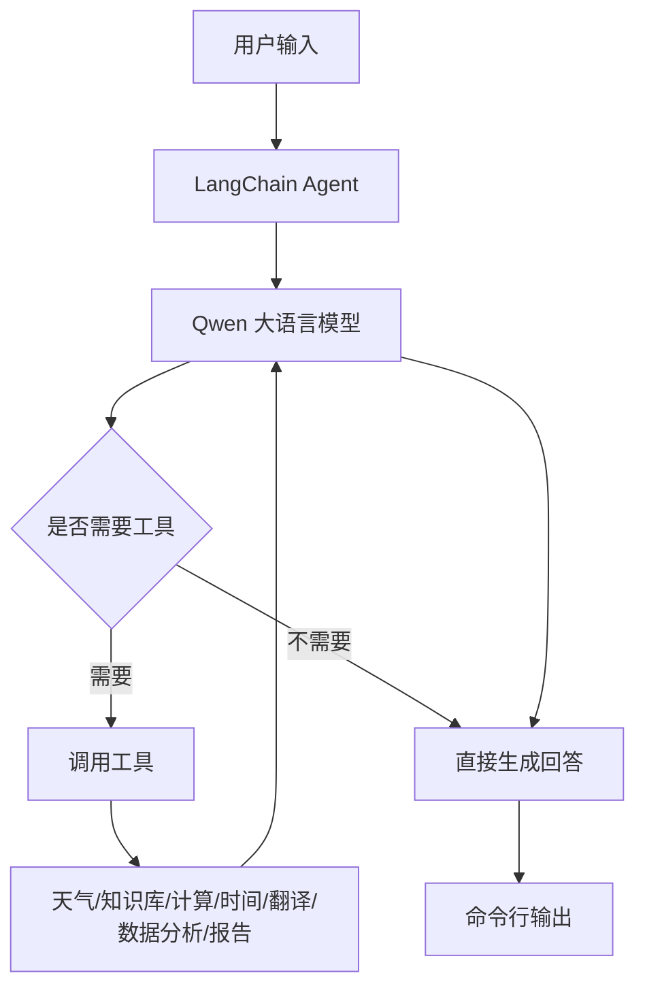

# LangChain 智能助手项目学习文档

面向对象：刚接触 AI Agent 开发的初学者。  
项目位置：`/Users/zhangchen/Desktop/example/langchain_example`

## 1. 这个项目学什么

这个项目用 LangChain 和通义千问 Qwen 做了一个中文智能助手。它不是只调用一次大模型，而是让大模型能够根据用户问题自动选择工具，例如查天气、查知识库、做数学计算、查时间、翻译、分析数据和生成报告。

你可以把它理解成一个“会用工具的聊天机器人”。普通聊天机器人只能根据模型已有知识回答，而 Agent 可以先判断“我需要调用哪个工具”，再拿工具返回的结果组织最终回答。

学完这个项目，你应该能理解：

- 什么是 Prompt，为什么提示词会影响模型行为。
- 什么是 Tool，为什么工具描述很重要。
- 什么是 Agent，Agent 如何决定调用工具。
- LangChain 的 `create_agent` 怎么使用。
- 如何把多个工具组合进一个智能助手。
- 如何做命令行交互、对话记忆、流式输出和异常处理。

## 2. 项目文件说明

项目主要有四个 Python 文件：

| 文件 | 作用 | 适合学习阶段 |
| --- | --- | --- |
| `langchain_prompt.py` | 演示 PromptTemplate、ChatPromptTemplate、Few-shot 等提示词模板 | 第一步 |
| `langchain_tools.py` | 演示如何定义工具、调用工具、把工具绑定给模型 | 第二步 |
| `langchain_agent.py` | 使用 `create_agent` 创建一个简单 Agent | 第三步 |
| `lanchain_Intelligent_assistant.py` | 综合版智能助手，包含多工具、记忆、流式输出、交互模式 | 第四步 |

建议学习顺序就是上面这个顺序。先理解提示词，再理解工具，最后理解 Agent。

## 3. 初学者必须先懂的核心概念

### 3.1 LLM 是什么

LLM 是 Large Language Model，大语言模型。项目里用的是通义千问 Qwen，通过 LangChain 的 `ChatTongyi` 调用。

在代码里通常是这样初始化的：

```python
llm = ChatTongyi(
    model="qwen-plus",
    temperature=0.7,
    dashscope_api_key=os.environ.get("DASHSCOPE_API_KEY")
)
```

几个参数的意思：

- `model`：使用哪个模型，例如 `qwen-plus`、`qwen-turbo`。
- `temperature`：控制回答随机性。越低越稳定，越高越发散。
- `dashscope_api_key`：调用模型服务需要的 API Key。

### 3.2 Prompt 是什么

Prompt 就是给模型的指令。它可以是简单字符串，也可以是带变量的模板。

比如：

```python
PromptTemplate.from_template(
    "请用{language}语言介绍一下{topic}，不超过100字。"
)
```

这相当于给模型准备了一个可复用模板。运行时只需要填入：

- `language="中文"`
- `topic="人工智能"`

最终得到：

```text
请用中文语言介绍一下人工智能，不超过100字。
```

Prompt 的价值是把“每次都要重复写的指令”封装起来，让模型输出更稳定。

### 3.3 Tool 是什么

Tool 是模型可以调用的外部能力。比如模型本身不会真正查天气，但你可以写一个天气查询函数，并把它注册成工具。

项目里用 `@tool` 装饰器定义工具：

```python
@tool
def get_weather(city: str) -> str:
    """获取指定城市的天气信息

    Args:
        city: 城市名称，如"北京"、"上海"
    """
    weather_db = {
        "北京": "晴天，温度15-25度，空气质量优",
        "上海": "多云，温度18-28度"
    }
    return weather_db.get(city, f"{city}的天气信息暂不可用")
```

这里有三个重点：

- 函数名要清楚，比如 `get_weather`。
- 参数类型要明确，比如 `city: str`。
- docstring 要写清楚用途和参数，因为模型会根据工具描述决定是否调用它。

### 3.4 Agent 是什么

Agent 是“模型加工具加决策循环”。

一个普通模型调用流程是：

```text
用户问题 -> 大模型 -> 回答
```

Agent 的流程是：

```text
用户问题 -> 大模型判断是否需要工具 -> 调用工具 -> 获取工具结果 -> 大模型组织最终回答
```

所以 Agent 的关键不是“能聊天”，而是“能决定下一步做什么”。

### 3.5 Memory 是什么

Memory 是对话记忆。没有记忆时，每次调用模型都像新对话。启用记忆后，模型可以知道前面聊过什么。

项目综合助手里使用了：

```python
from langgraph.checkpoint.memory import MemorySaver

checkpointer = MemorySaver()
```

然后传给 `create_agent`：

```python
agent = create_agent(
    model=llm,
    tools=TOOLS,
    system_prompt=SYSTEM_PROMPT,
    checkpointer=checkpointer
)
```

调用时还需要配置 `thread_id`：

```python
config = {"configurable": {"thread_id": "main_session"}}
```

这样不同会话可以用不同的线程 ID 隔离上下文。

## 4. 整体架构



这个架构里，Agent 是中间调度者。用户并不直接调用工具，工具也不直接回答用户，而是由大模型根据问题选择工具。

## 5. 从简单文件开始学习

### 5.1 `langchain_prompt.py`：学习提示词模板

这个文件演示了五种常见 Prompt 用法。

第一种是基础字符串模板：

```python
simple_template = PromptTemplate.from_template(
    "请用{language}语言介绍一下{topic}，不超过100字。"
)
```

适合用在格式固定、变量少的场景。

第二种是多变量模板：

```python
story_template = PromptTemplate(
    input_variables=["character", "setting", "conflict"],
    template="""
请创作一个短篇故事，要求如下：
- 主角：{character}
- 场景：{setting}
- 冲突：{conflict}
"""
)
```

适合结构化生成，例如写故事、生成报告、生成邮件。

第三种是聊天模板：

```python
chat_template = ChatPromptTemplate.from_messages([
    ("system", "你是一位{role}，擅长用简洁易懂的方式解释复杂概念。"),
    ("human", "请解释一下：{concept}"),
])
```

`system` 消息用于规定模型身份和规则，`human` 消息表示用户输入。

第四种是部分变量：

```python
partial_variables={
    "date": datetime.now().strftime("%Y年%m月%d日")
}
```

适合自动注入当前时间、公司名称、产品名称等固定上下文。

第五种是 Few-shot：

```python
examples = [
    {"input": "开心", "output": "我今天非常开心！"},
    {"input": "难过", "output": "我感到有些难过..."},
]
```

Few-shot 的意思是给模型几个示例，让模型模仿示例的风格和格式。

初学者要记住：Prompt 不是随便写一句话，而是对模型行为的约束。提示词越清晰，输出越稳定。

### 5.2 `langchain_tools.py`：学习工具

这个文件主要演示三类工具。

第一类是函数工具：

```python
@tool
def calculator(operation: str, a: float, b: float) -> float:
    """执行基本数学运算的计算器工具"""
```

LangChain 会读取函数名、参数类型和注释，把它转换成模型可识别的工具。

第二类是工具绑定：

```python
tools = [get_weather, get_time]
llm_with_tools = llm.bind_tools(tools)
```

这一步不是完整 Agent，只是让模型知道“我可以使用这些工具”。模型返回时可能会包含工具调用请求。

第三类是自定义工具类：

```python
class TemperatureConverter(BaseTool):
    name: str = "temperature_converter"
    description: str = "转换摄氏度和华氏度之间的温度"
```

自定义工具适合更复杂的场景，比如参数校验、异步调用、连接外部服务。

工具设计的经验：

- 一个工具只做一件事。
- 工具名要像动作，例如 `get_weather`、`search_database`。
- 参数不要太复杂，初学阶段最好 1 到 3 个参数。
- 返回结果要让模型容易读懂，不要返回混乱结构。

### 5.3 `langchain_agent.py`：创建最小 Agent

这个文件演示最基础的 Agent 创建方式。

核心代码：

```python
agent = create_agent(
    model=llm,
    tools=[get_weather, search_knowledge, calculator],
    system_prompt="你是一个专业的中文助手。仔细分析用户问题，选择合适的工具来回答。"
)
```

这里有三个核心组件：

- `model`：负责理解和生成。
- `tools`：提供外部能力。
- `system_prompt`：规定助手角色和行为规则。

调用 Agent：

```python
result = agent.invoke({
    "messages": [{"role": "user", "content": query}]
})
```

返回结果是一个消息列表。最后一条通常是助手最终回答：

```python
final_message = result["messages"][-1]
print(final_message.content)
```

这个文件适合理解 Agent 的最小闭环。

## 6. 综合助手 `lanchain_Intelligent_assistant.py` 详解

这是项目里最完整的文件。

它的功能包括：

- 天气查询。
- 知识库搜索。
- 数学计算。
- 当前时间。
- 文本翻译。
- 数据分析。
- 报告模板生成。
- 命令行交互。
- 流式输出。
- 对话记忆。
- 帮助命令和清空历史。

### 6.1 全局配置

```python
CONFIG = {
    "model": "qwen-plus",
    "temperature": 0.7,
    "verbose": True,
    "enable_streaming": True,
    "max_iterations": 10,
}
```

配置集中管理有两个好处：

- 修改模型、温度、流式输出时不需要到处找代码。
- 后续可以把配置迁移到 `.env` 或配置文件。

### 6.2 工具列表

综合助手把所有工具放在 `TOOLS` 中：

```python
TOOLS = [
    get_weather,
    search_knowledge,
    calculator,
    get_current_time,
    translate_text,
    analyze_data,
    generate_report,
]
```

Agent 创建时只要传入这个列表，就能获得全部工具能力。

### 6.3 系统提示词

综合助手的系统提示词比较完整，包含：

- 助手身份。
- 能力列表。
- 工作原则。
- 回答风格。

这类提示词的作用不是装饰，而是减少模型乱用工具、乱回答、格式不一致的问题。

初学者可以按这个模板写自己的系统提示词：

```text
你是谁。
你能做什么。
你应该如何工作。
你不能做什么。
你的回答风格是什么。
```

### 6.4 创建助手

```python
def create_smart_assistant(
    model_name: str = "qwen-plus",
    temperature: float = 0.7,
    enable_memory: bool = True,
    verbose: bool = True
):
```

这个函数把模型初始化、记忆初始化、Agent 创建封装起来。这样主程序只需要调用它，不需要关心内部细节。

这是工程化开发中的常见写法：把复杂初始化封装成函数。

### 6.5 交互模式

`run_interactive_mode()` 是命令行聊天循环。

核心流程：

```text
打印欢迎信息
创建 Agent
进入 while True 循环
读取用户输入
判断 quit/help/clear
调用 Agent
输出回答
捕获异常
```

这就是一个命令行 Agent 应用的基本结构。

### 6.6 流式输出

项目里使用：

```python
for chunk in agent.stream(inputs, config, stream_mode="values"):
```

流式输出的体验是模型边生成边显示，而不是等完整答案生成后一次性输出。

它的挑战是：

- 每个 chunk 里可能不一定有消息。
- 要判断最后一条消息是不是 AI 消息。
- 要避免重复打印已经输出过的内容。

项目里用 `final_response` 记录已输出内容，再打印新增部分，这是一个实用技巧。

## 7. 运行前准备

需要安装依赖并配置环境变量。项目使用通义千问，所以需要：

```text
DASHSCOPE_API_KEY=你的 DashScope API Key
```

通常放在 `.env` 文件中。

运行示例：

```bash
cd /Users/zhangchen/Desktop/example/langchain_example
python lanchain_Intelligent_assistant.py
```

如果没有配置 API Key，综合助手会提示：

```text
未找到 DASHSCOPE_API_KEY 环境变量
```

## 8. 常见问题和排查

### 8.1 模型没有调用工具

可能原因：

- 工具 docstring 写得不清楚。
- 用户问题没有明显触发工具。
- 系统提示词没有要求模型优先使用工具。

解决方式：

- 把工具描述写得更具体。
- 在系统提示词里说明“遇到天气、计算、翻译等问题时应调用工具”。
- 用简单问题测试，例如“计算 123 * 456”。

### 8.2 工具参数传错

比如天气工具需要 `city`，模型却传了复杂句子。

解决方式：

- 参数名使用明确语义。
- docstring 里写示例。
- 工具内部做容错，例如去掉空格、提取城市名。

### 8.3 计算器安全问题

项目里计算器用到了 `eval`。虽然做了字符白名单，但真实生产环境仍要谨慎。

更安全的做法：

- 使用专门的数学表达式解析库。
- 限制表达式长度。
- 禁止任何变量、函数和导入。
- 运行在沙箱环境中。

### 8.4 对话记忆混乱

如果所有用户都用同一个 `thread_id`，上下文会混在一起。

解决方式：

- 每个用户或每次会话使用独立 `thread_id`。
- 清空历史时切换新的 `thread_id`。

## 9. 这个项目的挑战点

第一，工具设计难。Agent 能不能正确调用工具，很大程度取决于工具描述和参数设计。

第二，多工具协作难。比如用户说“帮我分析这组数据并生成报告”，Agent 可能需要先调用数据分析工具，再调用报告生成工具。

第三，输出稳定性难。模型有时会不调用工具，或者调用错工具，需要靠提示词、工具描述和测试集不断调整。

第四，工程体验难。命令行交互、流式输出、错误处理、对话记忆、API Key 配置都不是模型能力本身，但是真正做应用时必须处理。

第五，模拟工具到真实工具的迁移难。项目里天气、知识库、翻译多为模拟数据，真实项目要接入外部 API，会带来鉴权、超时、错误码、限流和费用控制问题。

## 10. 初学者练习任务

### 练习 1：新增一个单位换算工具

目标：添加一个 `convert_length` 工具，支持米和公里互转。

你需要做：

- 定义 `@tool` 函数。
- 写清楚 docstring。
- 加入 `TOOLS` 列表。
- 测试“把 5000 米换算成公里”。

### 练习 2：把模拟翻译替换成真实模型翻译

目标：让 `translate_text` 不再只查固定字典，而是调用 LLM 完成翻译。

注意：

- 保留目标语言参数。
- 控制输出格式。
- 出错时返回友好提示。

### 练习 3：给数据分析工具增加趋势判断

目标：让 `analyze_data` 判断数据是上升、下降还是波动。

可以这样判断：

- 后一个数大多比前一个大，认为上升。
- 后一个数大多比前一个小，认为下降。
- 否则认为波动。

### 练习 4：增加用户会话 ID

目标：启动程序时让用户输入一个用户名，然后用用户名作为 `thread_id` 的一部分。

这样可以理解为什么多用户 Agent 需要会话隔离。

## 11. 学习总结

这个 LangChain 项目适合做 AI Agent 入门第一站。它覆盖了从 Prompt、Tool 到 Agent 的基本路径，也展示了一个命令行智能助手应该具备的工程结构。

最重要的学习结论是：

- Prompt 决定模型行为边界。
- Tool 决定 Agent 能力边界。
- Agent 负责在模型和工具之间做决策。
- 真实应用不只是调用模型，还要处理记忆、错误、流式输出和配置。

掌握这个项目后，再学习 LangGraph 的工作流和多 Agent 编排会更容易。

## 12. 教学增强：从零到能讲清楚的学习路线

如果你要把这个项目讲给初学者，不建议一上来就讲 `create_agent`。初学者最容易卡住的地方不是代码，而是不知道“模型、提示词、工具、Agent”之间的关系。

建议按下面四节课来讲。

### 第 1 课：先让模型回答一句话

目标：让学生知道 LLM 调用是怎么发生的。

讲解重点：

- API Key 是调用模型服务的凭证。
- `ChatTongyi` 是 LangChain 对通义千问聊天模型的封装。
- `llm.invoke()` 是最基础的一次模型调用。

课堂演示：

```python
from langchain_community.chat_models.tongyi import ChatTongyi

llm = ChatTongyi(
    model="qwen-turbo",
    dashscope_api_key="你的 API Key",
    temperature=0.7
)

response = llm.invoke("请用一句话解释什么是人工智能")
print(response.content)
```

学生需要理解：这一步没有工具，没有记忆，没有 Agent，只是“问模型一句话”。

### 第 2 课：把一句话变成可复用模板

目标：让学生理解 PromptTemplate 的价值。

如果每次都手写：

```text
请用中文介绍人工智能，不超过100字
请用英文介绍 LangChain，不超过100字
请用中文介绍向量数据库，不超过100字
```

代码会越来越乱。PromptTemplate 可以把固定部分沉淀下来。

示例：

```python
template = PromptTemplate.from_template(
    "请用{language}介绍{topic}，不超过{limit}字。"
)

prompt = template.format(
    language="中文",
    topic="LangChain",
    limit=100
)
```

课堂提问：

- 如果想让模型总是输出三点列表，应该把要求写在哪里？
- 如果想让模型语气更专业，应该改哪个变量？
- 如果学生把变量名写错，会发生什么？

### 第 3 课：让模型知道“可以使用工具”

目标：理解 Tool 的作用。

可以先不用 Agent，直接演示工具本身：

```python
result = calculator.invoke({
    "operation": "multiply",
    "a": 5,
    "b": 7
})
```

然后再讲：模型不能自己调用 Python 函数，LangChain 会把工具函数包装成模型可以理解的“工具说明书”。

这份说明书包含：

- 工具名。
- 工具描述。
- 参数名。
- 参数类型。
- 参数含义。

所以工具 docstring 不只是给人看的，也是给模型看的。

### 第 4 课：让 Agent 自己决定调用哪个工具

目标：理解 Agent 是“决策器”。

可以拿三个问题演示：

```text
北京天气怎么样？
什么是机器学习？
计算 123 * 456
```

让学生观察每个问题分别触发哪个工具。

讲解时强调：

- 用户没有直接调用 `get_weather`。
- 用户只是在自然语言提问。
- Agent 判断需要哪个工具。
- 工具结果返回给 Agent。
- Agent 再组织自然语言回答。

这就是 AI Agent 和普通脚本的差别。

## 13. 关键代码逐段讲解：综合助手主流程

这一节适合带学生逐段读 `lanchain_Intelligent_assistant.py`。

### 13.1 为什么先加载环境变量

```python
from dotenv import load_dotenv
load_dotenv()
```

项目需要 API Key，但 API Key 不应该直接写在代码里。原因有三个：

- 安全：代码可能上传到 GitHub。
- 灵活：不同机器可以使用不同 Key。
- 方便：换 Key 不用改代码。

`.env` 文件通常长这样：

```text
DASHSCOPE_API_KEY=sk-xxxx
```

代码里用：

```python
os.environ.get("DASHSCOPE_API_KEY")
```

读取。

### 13.2 为什么工具函数都返回字符串

例如天气工具返回：

```python
return result.strip()
```

初学者可能会问：为什么不返回字典？

原因是 Agent 最终要把工具结果交给 LLM 阅读。字符串对 LLM 更友好，尤其是教学项目。真实项目可以返回结构化 JSON，但要确保模型能理解字段含义。

建议规则：

- 给人读的工具，返回格式化字符串。
- 给程序继续处理的工具，返回结构化对象。
- 复杂项目里可以同时返回 `data` 和 `display_text`。

### 13.3 计算器工具为什么要做安全检查

项目里：

```python
allowed_chars = set('0123456789+-*/(). ')
```

这是为了防止用户输入危险表达式。因为 `eval` 可以执行 Python 表达式，如果不限制，很危险。

错误示例：

```python
eval("__import__('os').system('rm -rf /')")
```

教学时要强调：`eval` 在真实项目里要非常谨慎。这个项目虽然做了字符限制，但它仍然只是教学级写法。

更安全的方向：

- 用 `ast` 解析表达式。
- 用数学表达式库。
- 把计算放到隔离沙箱。
- 限制输入长度。

### 13.4 为什么要有 SYSTEM_PROMPT

如果不写系统提示词，模型可能不知道：

- 自己叫什么。
- 可以做什么。
- 什么时候该用工具。
- 回答风格是什么。
- 工具失败时怎么办。

项目里的系统提示词把能力列出来：

```text
天气查询
知识搜索
数学计算
时间服务
文本翻译
数据分析
报告生成
```

这不是为了好看，而是为了降低模型误判。

写系统提示词时建议包含五部分：

```text
角色：你是谁
能力：你会什么
流程：你如何工作
边界：你不能做什么
风格：你怎么回答
```

### 13.5 为什么交互模式要处理特殊命令

综合助手支持：

```text
quit
help
clear
```

这很像真实产品里的控制命令。

- `quit`：退出程序。
- `help`：展示使用说明。
- `clear`：清空会话上下文。

如果没有这些命令，用户体验会很差。尤其是 Agent 有记忆时，如果上下文乱了，用户需要一个方式重新开始。

## 14. 一个问题从输入到回答的完整执行过程

以用户输入为例：

```text
帮我分析这组数据：10,20,30,40,50
```

完整过程如下。

### 第一步：命令行读取用户输入

```python
user_input = input("\n👤 你: ").strip()
```

此时得到字符串：

```text
帮我分析这组数据：10,20,30,40,50
```

### 第二步：构造 Agent 输入

```python
inputs = {"messages": [{"role": "user", "content": user_input}]}
```

LangGraph/LangChain Agent 使用 messages 格式承载对话。

### 第三步：Agent 分析意图

模型看到用户说“分析这组数据”，会判断应该调用 `analyze_data` 工具。

它需要从自然语言里提取：

```text
data = "10,20,30,40,50"
analysis_type = "summary"
```

### 第四步：工具执行

`analyze_data` 会：

- 按逗号切分数字。
- 转成 float。
- 计算数量、总和、平均值、中位数。
- 计算方差、标准差、最大值、最小值。
- 返回格式化报告。

### 第五步：Agent 组织最终回答

工具结果返回后，模型再用自然语言给用户解释。

注意：工具负责“算”，模型负责“讲清楚”。

这是一种很常见的 Agent 分工模式。

## 15. 适合初学者的调试方法

### 15.1 先单独测试工具

不要一开始就测试 Agent。先测试工具函数是否正常。

例如：

```python
print(get_weather.invoke({"city": "北京"}))
print(calculator.invoke({"expression": "123*456"}))
```

如果工具本身有问题，Agent 一定也会出问题。

### 15.2 再测试模型是否能识别工具

可以问明确问题：

```text
请调用计算器计算 123 * 456
```

如果明确要求调用工具都失败，说明工具描述、模型工具调用能力或 Agent 配置有问题。

### 15.3 最后测试自然语言表达

再问模糊一点的问题：

```text
帮我算一下 123 乘以 456
```

这样可以测试 Agent 的理解能力。

### 15.4 打印消息历史

Agent 返回的 `messages` 里通常包含：

- 用户消息。
- AI 工具调用消息。
- 工具返回消息。
- AI 最终回答。

调试时不要只看最后回答，要把中间消息打印出来。

## 16. 如何把这个项目讲成简历项目

如果写到简历里，不建议写：

```text
使用 LangChain 做了一个智能助手。
```

太笼统。

可以写成：

```text
基于 LangChain create_agent 和通义千问 Qwen 构建多工具中文智能助手，集成天气查询、知识库搜索、数学计算、时间查询、文本翻译、数据分析和报告生成等工具能力；设计系统提示词和工具 Schema，引导模型自动完成工具选择与多步推理；支持会话记忆、流式输出、命令行交互和异常兜底。
```

面试时可以这样讲项目亮点：

- 我把模型能力和工具能力分开设计。
- 工具通过 `@tool` 暴露给 Agent。
- 系统提示词约束 Agent 的角色、能力和回答风格。
- 用 `MemorySaver` 实现会话级记忆。
- 流式输出提升交互体验。
- 对工具输入做了基础安全校验和错误处理。

面试官可能追问：

1. Agent 和普通 LLM 调用有什么区别？
2. 工具描述为什么会影响调用效果？
3. 如果模型调用错工具，你怎么排查？
4. 多用户场景下 thread_id 怎么设计？
5. 计算器工具用 `eval` 有什么风险？

你应该能用这份文档里的内容回答。

## 17. 可继续扩展的方向

### 17.1 接入真实天气 API

当前天气是模拟字典。可以改成请求真实天气服务。

需要新增：

- API Key 配置。
- HTTP 请求。
- 超时处理。
- 城市名标准化。
- 错误码处理。

### 17.2 接入真实知识库

当前知识库是内存字典。可以改成：

- SQLite。
- Elasticsearch。
- Milvus。
- 本地 Markdown 文档检索。

这会自然过渡到 RAG 项目。

### 17.3 做成 Web API

当前是命令行交互。可以加 FastAPI：

```text
POST /chat
```

请求：

```json
{
  "message": "北京天气怎么样？",
  "thread_id": "user-001"
}
```

响应：

```json
{
  "answer": "...",
  "tool_used": "get_weather"
}
```

### 17.4 增加工具调用日志

真实项目里要记录：

- 用户问题。
- 模型选择了哪个工具。
- 工具参数是什么。
- 工具返回是否成功。
- 最终回答是什么。

这样才能分析 Agent 的错误。

## 18. 小测验

1. `PromptTemplate` 和普通字符串有什么区别？
2. `@tool` 装饰器的作用是什么？
3. Agent 为什么需要系统提示词？
4. `thread_id` 的作用是什么？
5. 为什么工具 docstring 要写清楚？
6. `temperature` 调高会产生什么影响？
7. 流式输出相比一次性输出有什么优点？
8. 为什么不建议在生产环境随便使用 `eval`？
9. 如果 Agent 不调用工具，应该从哪三方面排查？
10. 如何把这个命令行助手改造成 Web 应用？
