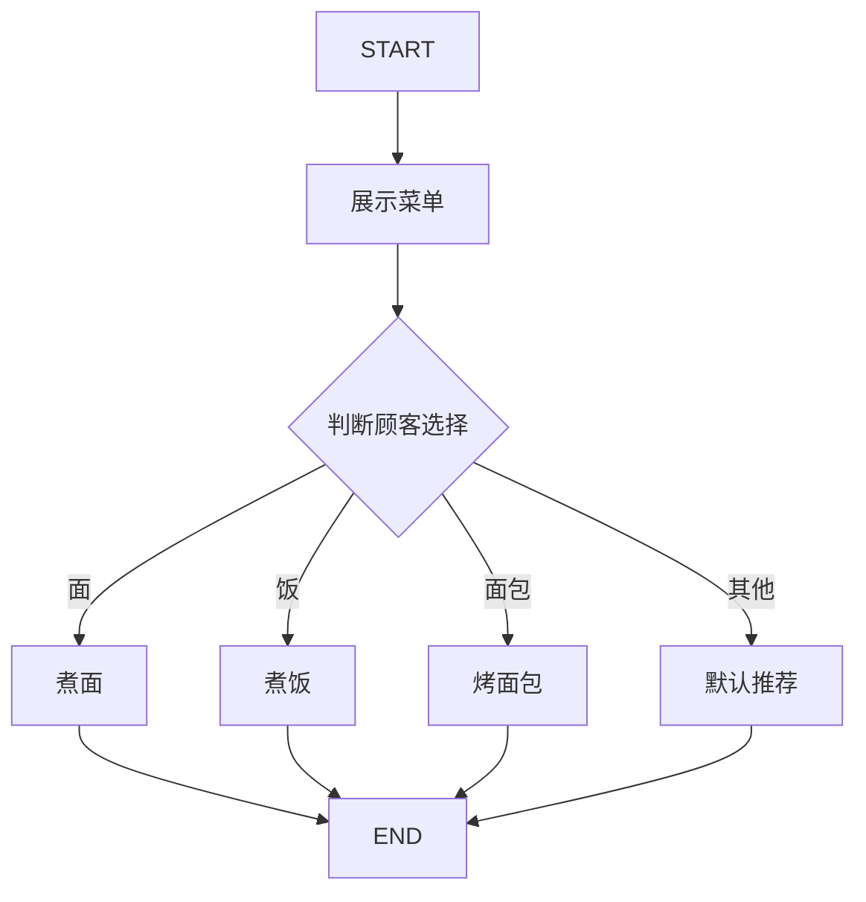
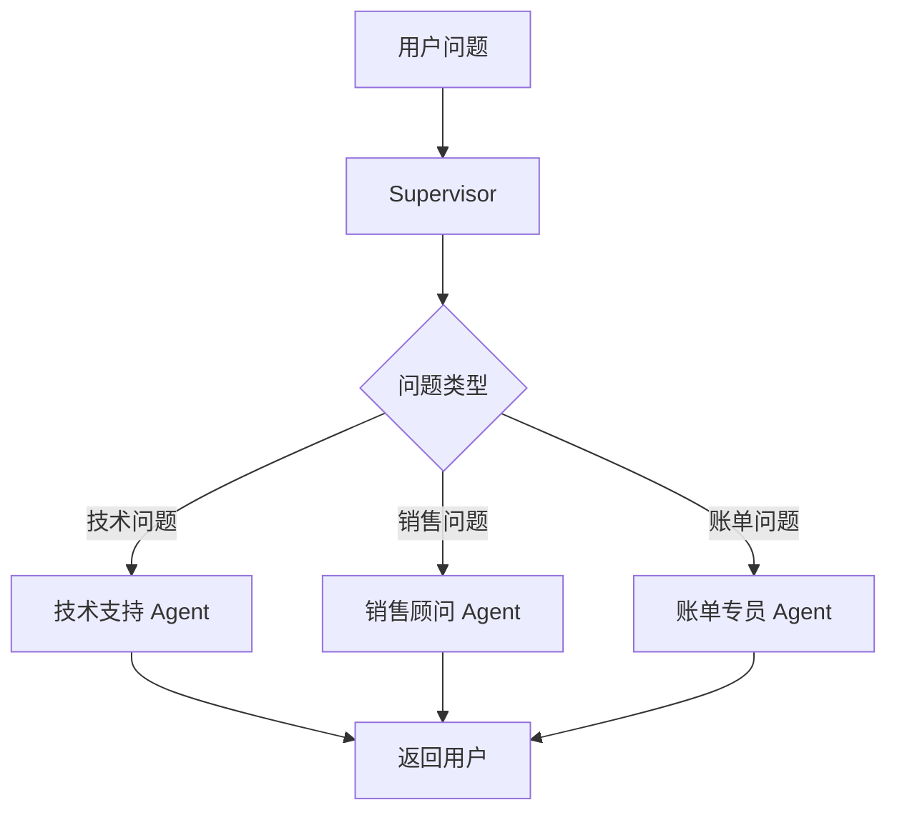
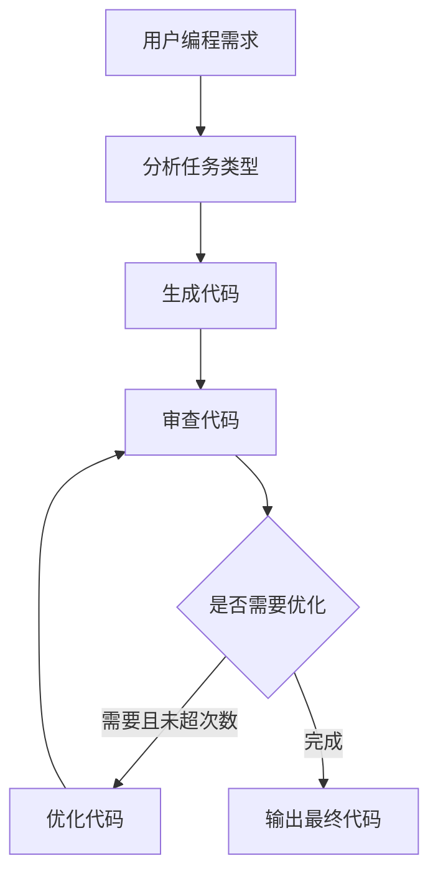

# LangGraph 多智能体编排项目学习文档

面向对象：已经了解 LangChain 基础 Agent，想继续学习工作流、多步骤任务和多智能体协作的初学者。  
项目位置：`/Users/zhangchen/Desktop/example/langgraph_example`

## 1. 这个项目学什么

LangChain 更适合快速创建“会用工具的 Agent”，而 LangGraph 更适合构建“有流程、有状态、有分支、有循环”的 Agent 系统。

这个项目包含大量 LangGraph 示例，核心学习目标是：

- 理解节点、边、状态、条件路由这些 LangGraph 基础概念。
- 学会用 `StateGraph` 表达一个流程。
- 学会用条件边处理不同用户意图。
- 学会让多个节点共享和更新状态。
- 学会构建 ReAct Agent。
- 学会构建 Supervisor 模式的多 Agent 系统。
- 学会构建带“生成、审查、优化”循环的编程助手。

如果说 LangChain Agent 像一个“会用工具的员工”，LangGraph 更像一个“工作流系统”，它能安排多个员工按规则协作。

## 2. 项目文件说明

这个目录文件较多，可以分成四类学习。

| 文件类型 | 示例文件 | 学习重点 |
| --- | --- | --- |
| 基础图结构 | `graph_node_edge.py` 到 `graph_node_edge8.py` | 节点、边、条件分支、路由 |
| 基础 LangGraph | `langgraph_1.py` 到 `langgraph_5.py` | 状态图、任务流、循环优化 |
| 单 Agent 示例 | `langgraph_agent_1.py` 到 `langgraph_agent_4.py` | ReAct Agent、工具调用 |
| 多 Agent 示例 | `langgraph_supervisor_1.py`、`langgraph_supervisor_2.py` | Supervisor 路由、多智能体协作 |

推荐学习顺序：

1. 先看 `graph_node_edge` 系列，理解图的基本概念。
2. 再看 `langgraph_agent` 系列，理解 Agent 如何放进图里。
3. 最后看 `langgraph_supervisor_2.py` 和 `langgraph_5.py`，理解多 Agent 和循环优化。

## 3. LangGraph 的核心概念

### 3.1 State 是状态

State 是整个流程共享的数据。每个节点读取 State，也可以返回新的字段来更新 State。

例如餐厅点餐示例里：

```python
class OrderState(TypedDict):
    customer_choice: str
    dish: str
```

这表示流程中会携带两个字段：

- `customer_choice`：用户点了什么。
- `dish`：最后做出来什么菜。

初学者可以把 State 理解成“流程里的共享表单”。

### 3.2 Node 是节点

Node 是一个处理步骤，本质上就是一个函数。

例如：

```python
def cook_noodles_node(state: OrderState):
    print("厨师: 正在煮面...")
    return {"dish": "热腾腾的拉面"}
```

节点接收当前状态 `state`，返回要更新的字段。

注意：节点通常不要直接修改原始 state，而是返回一个字典，让 LangGraph 负责合并。

### 3.3 Edge 是边

Edge 表示流程从一个节点走到另一个节点。

```python
workflow.add_edge(START, "menu")
workflow.add_edge("cook_noodles", END)
```

意思是：

- 从开始进入 `menu` 节点。
- `cook_noodles` 执行完后结束。

### 3.4 Conditional Edge 是条件边

条件边表示根据状态决定下一步去哪里。

```python
workflow.add_conditional_edges(
    "menu",
    route_to_kitchen,
    {
        "noodles": "cook_noodles",
        "rice": "cook_rice",
        "bread": "bake_bread",
        "default": "default_meal"
    }
)
```

`route_to_kitchen` 是路由函数，它返回一个字符串，比如 `"noodles"`。LangGraph 根据这个字符串选择下一个节点。

这就是 LangGraph 最核心的能力之一：不是固定线性流程，而是动态分支。

### 3.5 START 和 END

`START` 是图的入口，`END` 是图的出口。

一个最简单的图是：

```text
START -> node_a -> END
```

复杂图可以有多个分支、多个节点，甚至循环。

## 4. 基础示例：餐厅点餐路由

`graph_node_edge8.py` 是一个非常适合初学者理解条件路由的例子。

流程是：



核心路由函数：

```python
def route_to_kitchen(state: OrderState) -> Literal["noodles", "rice", "bread", "default"]:
    choice = state["customer_choice"].lower()

    if "面" in choice or "noodle" in choice:
        return "noodles"
    elif "饭" in choice or "rice" in choice:
        return "rice"
    elif "面包" in choice or "bread" in choice:
        return "bread"
    else:
        return "default"
```

这个例子的学习价值是：LangGraph 不是一上来就必须接大模型。它本质上是一个状态机和流程编排框架。你可以先用普通 Python 函数写清楚流程，再把 LLM 放进去。

## 5. 单 Agent 示例：数学计算 Agent

`langgraph_agent_4.py` 展示了一个数学计算 Agent。

它定义了三个工具：

```python
@tool
def add(a: float, b: float) -> float:
    return a + b

@tool
def multiply(a: float, b: float) -> float:
    return a * b

@tool
def divide(a: float, b: float) -> float:
    if b == 0:
        return "错误: 除数不能为0"
    return a / b
```

然后使用：

```python
math_agent = create_react_agent(
    model=create_qwen_model(),
    tools=[add, multiply, divide],
    messages_modifier=system_prompt
)
```

这里的 `create_react_agent` 会创建一个 ReAct Agent。

ReAct 的意思是：

- Reasoning：模型先思考需要做什么。
- Acting：模型调用工具执行动作。
- Observation：模型看到工具结果。
- Repeat：如果还没完成，继续下一步。

数学问题特别适合演示 ReAct，因为模型可能需要拆成多个步骤。

例如用户问：

```text
计算 (10 + 5) × 3
```

合理流程是：

```text
先调用 add(10, 5) 得到 15
再调用 multiply(15, 3) 得到 45
最后回答 45
```

这个例子告诉我们：Agent 不只是调用一次工具，它可以多次调用工具完成任务。

## 6. Supervisor 多智能体客服系统

`langgraph_supervisor_2.py` 是项目里最重要的多 Agent 示例之一。

它模拟一个智能客服系统，里面有三个专业 Agent：

- 技术支持 Agent：处理错误、系统、服务器、API 问题。
- 销售顾问 Agent：处理产品、价格、套餐、优惠问题。
- 账单专员 Agent：处理发票、支付、退款问题。

Supervisor 是总调度，它负责判断用户问题应该交给谁。

整体架构：



### 6.1 状态定义

```python
class SupervisorState(TypedDict):
    messages: Annotated[Sequence[BaseMessage], add_messages]
    next: str
```

这里有两个字段：

- `messages`：所有对话消息。
- `next`：Supervisor 决定下一个执行哪个 Agent。

`add_messages` 表示消息不是覆盖，而是追加。

### 6.2 Supervisor 节点

Supervisor 根据关键词判断路由：

```python
tech_keywords = ["错误", "bug", "崩溃", "error", "系统", "服务器", "API"]
sales_keywords = ["价格", "购买", "产品", "套餐", "订阅", "优惠"]
billing_keywords = ["发票", "支付", "退款", "账单", "费用"]
```

如果用户说：

```text
我遇到500错误，系统无法访问
```

就会路由到技术支持。

如果用户说：

```text
我想了解专业版的价格和优惠
```

就会路由到销售顾问。

### 6.3 专业 Agent 节点

每个 Agent 都只处理自己的领域。

技术支持工具：

- `check_system_status`
- `search_error_code`

销售工具：

- `get_product_info`
- `check_promotion`
- `calculate_price`

账单工具：

- `query_invoice`
- `check_payment_status`
- `request_refund`

这种设计体现了一个重要原则：不要让一个 Agent 什么都做。复杂系统更适合拆成多个角色，每个角色负责一类任务。

### 6.4 路由函数

```python
def route_after_supervisor(state: SupervisorState) -> Literal["tech_support", "sales", "billing", "__end__"]:
    next_agent = state["next"]

    if next_agent == "FINISH":
        return "__end__"
    return next_agent
```

这个函数把 Supervisor 的决策转换成 LangGraph 可识别的路由结果。

## 7. 智能编程助手：生成、审查、优化循环

`langgraph_5.py` 展示了一个更接近真实生产系统的例子：智能编程助手。

它包含三个模型角色：

- `analyzer_llm`：分析用户请求类型。
- `coder_llm`：生成代码。
- `reviewer_llm`：审查代码。

状态定义：

```python
class CodingState(MessagesState):
    task_type: Literal["generate", "debug", "explain", "optimize"]
    code: str
    review_result: str
    iteration: Annotated[int, operator.add]
    max_iterations: int
```

这个状态比点餐示例复杂很多，因为它要保存：

- 当前任务类型。
- 当前代码。
- 审查结果。
- 已优化次数。
- 最大优化次数。

流程图：



这个例子最重要的点是循环。

普通流程通常是：

```text
A -> B -> C -> END
```

但真实 Agent 系统经常需要：

```text
生成 -> 检查 -> 不满意 -> 修改 -> 再检查 -> 满意 -> 结束
```

这就是 LangGraph 的优势。

## 8. 为什么要用 LangGraph，而不只用普通函数

普通 Python 也能写 if else 和循环，为什么还需要 LangGraph？

因为 Agent 系统通常有这些需求：

- 每一步都要保存状态。
- 不同步骤可能由不同模型或工具完成。
- 需要根据模型输出动态路由。
- 需要观察每一步消息。
- 需要支持多轮、多节点和可恢复执行。
- 需要把流程结构可视化和维护。

当流程很简单时，普通函数足够。  
当流程开始出现多节点、多分支、多 Agent、循环优化时，LangGraph 更清晰。

## 9. 运行前准备

项目使用通义千问，需要配置：

```text
DASHSCOPE_API_KEY=你的 DashScope API Key
```

部分文件里直接写了：

```python
os.environ["DASHSCOPE_API_KEY"] = ""
```

学习时可以改成从 `.env` 读取，避免把密钥写进代码。

运行某个示例：

```bash
cd /Users/zhangchen/Desktop/example/langgraph_example
python graph_node_edge8.py
python langgraph_agent_4.py
python langgraph_supervisor_2.py
python langgraph_5.py
```

建议先运行不依赖真实模型的图结构示例，再运行需要 Qwen 的 Agent 示例。

## 10. 常见问题和排查

### 10.1 路由函数返回值不匹配

条件边要求路由函数返回的字符串必须出现在映射表里。

例如：

```python
return "noodle"
```

但映射表写的是：

```python
{"noodles": "cook_noodles"}
```

就会出错。

解决方式：让路由函数返回值和映射表 key 完全一致。

### 10.2 状态字段缺失

如果节点里访问：

```python
state["task_type"]
```

但初始输入没有提供 `task_type`，就可能报错。

解决方式：

- 初始输入提供完整字段。
- 节点里使用 `state.get("task_type", "generate")`。
- 明确每个节点负责写入哪些字段。

### 10.3 循环无法结束

如果优化条件一直返回 `"optimize"`，流程会不断循环。

项目里通过 `iteration` 和 `max_iterations` 控制：

```python
if "需要改进" in review and iteration < max_iter:
    return "optimize"
return "done"
```

真实项目中一定要设计最大循环次数。

### 10.4 多 Agent 职责重叠

如果销售 Agent 和账单 Agent 都能回答“费用问题”，Supervisor 可能路由不稳定。

解决方式：

- 明确每个 Agent 的职责边界。
- Supervisor prompt 或规则里写清楚优先级。
- 给边界问题增加测试样例。

## 11. 这个项目的挑战点

第一，状态设计难。LangGraph 项目的质量很大程度取决于 State 设计。如果状态字段混乱，后面节点就会越来越难维护。

第二，路由规则难。简单关键词路由容易理解，但真实用户表达很多样，后续可能要改成 LLM 路由或分类模型。

第三，循环控制难。代码生成和优化这类任务天然需要多轮，但必须防止无限循环。

第四，多 Agent 边界难。专业 Agent 要分工明确，否则会出现多个 Agent 抢同一个问题，或者没人负责某类问题。

第五，调试难。LangGraph 执行过程比单次模型调用复杂，调试时要打印每个节点输入、输出和最终状态。

## 12. 初学者练习任务

### 练习 1：给餐厅点餐增加饮料分支

目标：在 `graph_node_edge8.py` 中增加一个 `drink` 路由。

你需要做：

- 在 `Literal` 中增加 `"drink"`。
- 新增 `make_drink_node`。
- 在路由函数里识别“饮料”、“可乐”、“coffee”等关键词。
- 在条件边映射表里加入 `"drink": "make_drink"`。

### 练习 2：让客服系统支持“人工客服”

目标：当用户说“不满意”、“人工”、“投诉”时，路由到人工客服节点。

你需要做：

- 新增 `human_service` 节点。
- Supervisor 增加关键词。
- 条件边增加映射。

### 练习 3：给编程助手增加测试节点

目标：生成代码后，先运行测试，再进入审查。

你需要做：

- 新增 `test_code_node`。
- 在 State 中增加 `test_result`。
- 修改流程为 `generate -> test -> review`。

### 练习 4：把关键词路由改成 LLM 路由

目标：让 Supervisor 不再用关键词，而是让模型判断问题类型。

提示词可以要求模型只返回：

```text
tech_support
sales
billing
human_service
```

注意：一定要做输出校验。如果模型返回其他内容，要有默认路由。

## 13. 学习总结

这个 LangGraph 项目的核心价值是让你从“单个 Agent”升级到“Agent 工作流系统”。

你需要记住：

- State 是共享数据。
- Node 是处理步骤。
- Edge 是执行顺序。
- Conditional Edge 是动态分支。
- Supervisor 是多 Agent 系统里的调度者。
- 循环流程必须有退出条件。

掌握这个项目后，你就可以设计更复杂的 AI 应用，例如审批流 Agent、客服分流系统、代码生成系统、内容审核系统和数据分析工作流。

## 14. 教学增强：为什么 LangGraph 对初学者重要

很多初学者学完 LangChain Agent 后，会自然遇到一个问题：如果任务不是一步完成，而是需要多个阶段怎么办？

例如：

```text
用户说：帮我写一段代码，检查质量，如果不合格就优化，最后给我最终版本。
```

这不是简单的一次问答。它至少包含：

1. 理解需求。
2. 生成代码。
3. 审查代码。
4. 判断是否合格。
5. 不合格则优化。
6. 再审查。
7. 输出最终结果。

这种任务如果只用普通 Agent，很容易变得不可控。LangGraph 的作用就是把这些步骤显式画出来。

你可以告诉学生：

- LangChain 解决“模型如何调用工具”。
- LangGraph 解决“多个步骤如何组织成流程”。

这句话很关键。

## 15. State 设计详细讲解

LangGraph 项目里最重要的不是节点函数，而是 State 设计。

### 15.1 State 为什么重要

State 是每个节点都能看到的共享数据。设计不好会导致：

- 节点不知道要读哪个字段。
- 后一个节点拿不到前一个节点的结果。
- 字段名字混乱。
- 循环次数无法控制。
- 调试时不知道数据在哪里变化。

所以写 LangGraph 前，建议先画一张表：

| 字段名 | 类型 | 谁写入 | 谁读取 | 用途 |
| --- | --- | --- | --- | --- |
| `messages` | 消息列表 | 用户/Agent | 所有节点 | 保存对话历史 |
| `task_type` | 字符串 | 分析节点 | 路由函数 | 判断任务类型 |
| `code` | 字符串 | 代码生成节点 | 审查/优化节点 | 保存当前代码 |
| `review_result` | 字符串 | 审查节点 | 条件路由/优化节点 | 判断是否需要优化 |
| `iteration` | 整数 | 优化节点 | 条件路由 | 防止无限循环 |
| `max_iterations` | 整数 | 初始输入 | 条件路由 | 最大优化次数 |

这张表比代码更重要。只要字段关系清楚，图就不会乱。

### 15.2 TypedDict 的意义

项目里经常写：

```python
class OrderState(TypedDict):
    customer_choice: str
    dish: str
```

`TypedDict` 的作用是告诉开发者：这个 state 应该有哪些字段，每个字段是什么类型。

它不是数据库表，也不是强校验系统，但能让代码更清晰。

### 15.3 MessagesState 的意义

在编程助手示例里：

```python
class CodingState(MessagesState):
    task_type: Literal["generate", "debug", "explain", "optimize"]
```

`MessagesState` 是 LangGraph 里常用的消息状态基类，适合聊天和 Agent 场景。

它已经包含 `messages` 字段，所以你可以在它基础上增加业务字段。

### 15.4 Annotated 和 operator.add 是什么

项目里有：

```python
iteration: Annotated[int, operator.add]
```

这表示：当节点返回新的 `iteration` 时，不是覆盖，而是累加。

例如当前：

```python
iteration = 1
```

节点返回：

```python
{"iteration": 1}
```

合并后变成：

```python
iteration = 2
```

这对统计循环次数很方便。

## 16. 节点函数设计规范

一个好的节点函数应该满足四点：

1. 输入明确：知道自己需要读 state 的哪些字段。
2. 输出明确：只返回自己负责更新的字段。
3. 职责单一：一个节点只做一类事情。
4. 容错清晰：输入缺失或模型异常时有默认行为。

### 16.1 不推荐的写法

```python
def node(state):
    # 又分析任务，又生成代码，又审查
    ...
    return state
```

问题：

- 职责太多。
- 返回整个 state 容易覆盖别的字段。
- 不方便插入新步骤。
- 不方便调试。

### 16.2 推荐的写法

```python
def analyze_task_node(state: CodingState):
    user_request = state["messages"][-1].content
    task_type = analyzer_llm.invoke(prompt).strip().lower()

    if task_type not in ["generate", "debug", "explain", "optimize"]:
        task_type = "generate"

    return {"task_type": task_type}
```

这个节点只做一件事：分析任务类型。

### 16.3 节点输出为什么是字典

LangGraph 会把节点返回的字典合并进 State。

例如：

```python
return {"dish": "热腾腾的拉面"}
```

表示只更新 `dish` 字段，其他字段保持不变。

这样每个节点就像在填写流程表单的一部分。

## 17. 路由函数详细讲解

路由函数是 LangGraph 里最容易写错的地方。

### 17.1 路由函数做什么

路由函数接收当前 state，返回一个路由标签。

例如：

```python
def route_by_task(state: CodingState) -> str:
    return state["task_type"]
```

它不负责执行任务，只负责告诉图：“下一步去哪”。

### 17.2 路由返回值必须稳定

假设条件边写的是：

```python
{
    "generate": "generate",
    "debug": "generate",
    "explain": "generate",
    "optimize": "generate"
}
```

那么路由函数只能返回这些 key。  
如果模型返回了：

```text
代码生成
```

就会找不到对应分支。

所以在使用 LLM 做路由时，一定要做归一化：

```python
if task_type not in ["generate", "debug", "explain", "optimize"]:
    task_type = "generate"
```

### 17.3 条件边和普通边的区别

普通边：

```python
workflow.add_edge("generate", "review")
```

表示生成完一定去审查。

条件边：

```python
workflow.add_conditional_edges(
    "review",
    check_review_result,
    {
        "optimize": "optimize",
        "done": END
    }
)
```

表示审查后可能去优化，也可能结束。

教学时可以类比：

- 普通边是“固定下一步”。
- 条件边是“根据情况选择下一步”。

## 18. Supervisor 模式详细讲解

Supervisor 模式是多 Agent 系统里非常常见的架构。

### 18.1 为什么需要 Supervisor

如果所有问题都交给一个 Agent，它需要懂技术、销售、账单、投诉、售后等所有领域。这样会导致：

- 系统提示词很长。
- 工具列表很乱。
- 模型容易选错工具。
- 不同任务之间相互干扰。

Supervisor 的思路是：先判断问题属于哪类，再交给专业 Agent。

这就像公司前台：

```text
用户来咨询 -> 前台判断 -> 转给技术/销售/财务
```

### 18.2 Supervisor 的职责边界

Supervisor 不应该亲自解决所有问题。它只负责：

- 读取用户问题。
- 判断问题类型。
- 设置 `next` 字段。
- 把流程导向对应 Agent。

专业 Agent 才负责真正回答。

### 18.3 专业 Agent 的职责边界

技术支持 Agent：

- 处理错误码。
- 检查系统状态。
- 解释技术故障。

销售 Agent：

- 介绍套餐。
- 查询优惠。
- 计算价格。

账单 Agent：

- 查询发票。
- 查询支付状态。
- 处理退款。

边界越清晰，系统越稳定。

### 18.4 关键词路由的局限

项目里使用关键词：

```python
tech_keywords = ["错误", "bug", "崩溃", "error", "系统", "服务器", "API"]
```

优点：

- 简单。
- 可控。
- 容易调试。

缺点：

- 用户表达稍微变化就可能识别不到。
- 多意图问题不好处理。
- 复杂语义需要很多关键词。

进阶方案：

- 用 LLM 分类。
- 用小模型做意图识别。
- 用规则和 LLM 混合。
- 给用户意图打多个标签。

## 19. 编程助手循环流程详细讲解

`langgraph_5.py` 的价值在于展示“反思和迭代”。

### 19.1 为什么代码生成后要审查

LLM 生成代码可能出现：

- 语法错误。
- 缺少边界条件。
- 性能低。
- 注释不清晰。
- 不符合规范。

所以不能生成后直接交付，而要经过审查节点。

### 19.2 审查节点如何影响流程

审查节点输出：

```python
return {"review_result": review}
```

然后条件路由读取：

```python
review = state["review_result"]
iteration = state.get("iteration", 0)
max_iter = state.get("max_iterations", 2)
```

如果发现“需要改进”，并且没有超过最大次数，就进入优化节点。

### 19.3 为什么要设置 max_iterations

LLM 审查可能每次都说“需要改进”。如果不限制次数，图会无限循环。

最大迭代次数是一条安全绳。

教学时要强调：凡是循环，都必须有明确退出条件。

### 19.4 如何让这个编程助手更真实

可以继续增加：

- 单元测试节点。
- 代码执行节点。
- 安全扫描节点。
- 格式化节点。
- 最终总结节点。

扩展后的流程可以是：

```text
分析需求 -> 生成代码 -> 运行测试 -> 审查代码 -> 优化代码 -> 再测试 -> 输出
```

## 20. 一次完整执行过程示例

以用户输入为例：

```text
写一个快速排序的 Python 实现
```

执行过程：

1. `START` 进入 `analyze`。
2. `analyze_task_node` 判断任务类型为 `generate`。
3. 条件路由进入 `generate`。
4. `code_generation_node` 生成快速排序代码，并写入 `state["code"]`。
5. 普通边进入 `review`。
6. `code_review_node` 从正确性、可读性、性能、规范性审查代码。
7. `check_review_result` 判断是否需要优化。
8. 如果需要优化，进入 `optimize`。
9. `code_optimize_node` 生成优化版代码，`iteration + 1`。
10. 再回到 `review`。
11. 满足条件后进入 `END`。

这就是 LangGraph 的执行链路。

## 21. 调试 LangGraph 的实用方法

### 21.1 每个节点入口打印 state 摘要

不要打印完整 state，可能太长。可以打印关键字段：

```python
print("当前任务类型:", state.get("task_type"))
print("当前迭代次数:", state.get("iteration"))
```

### 21.2 每个节点出口打印返回值

例如：

```python
result = {"task_type": task_type}
print("analyze 返回:", result)
return result
```

这样能看到状态在哪里发生变化。

### 21.3 路由函数必须打印决策

```python
def check_review_result(state):
    decision = "optimize" if ... else "done"
    print("路由决策:", decision)
    return decision
```

调试多分支时这非常重要。

### 21.4 先用假模型测试流程

不要一开始就接真实 LLM。可以让节点返回固定值，先验证图结构。

例如：

```python
def analyze_task_node(state):
    return {"task_type": "generate"}
```

图跑通后，再接入真实模型。

## 22. 如何把这个项目讲成简历项目

简历写法可以是：

```text
基于 LangGraph 构建多智能体工作流示例系统，覆盖条件路由、状态管理、ReAct Agent、Supervisor 调度和循环优化等能力；实现智能客服分流系统和编程助手工作流，将技术支持、销售、账单等 Agent 按职责拆分，通过 Supervisor 根据用户意图动态路由；在编程助手中设计“任务分析-代码生成-代码审查-代码优化”的闭环流程，并通过迭代次数控制防止无限循环。
```

可以强调的技术点：

- `StateGraph` 状态图建模。
- `TypedDict`/`MessagesState` 状态设计。
- 条件边动态路由。
- Supervisor 多 Agent 编排。
- ReAct 工具调用。
- 循环流程和终止条件。

面试官可能追问：

1. LangGraph 和 LangChain Agent 有什么区别？
2. State 设计时要注意什么？
3. 条件边如何保证路由稳定？
4. Supervisor 模式适合什么场景？
5. 怎么防止工作流无限循环？
6. 多 Agent 职责重叠时怎么处理？
7. 如果路由错了，怎么调试？

## 23. 课堂练习：从规则到 LLM 路由

### 第一阶段：规则路由

先用关键词：

```python
if "发票" in message:
    return "billing"
```

让学生理解流程。

### 第二阶段：LLM 路由

再改成模型分类：

```text
请判断用户问题属于以下哪一类：
tech_support, sales, billing
只返回类别名。
```

### 第三阶段：输出校验

如果模型返回：

```text
这个问题属于技术支持
```

需要清洗成：

```text
tech_support
```

如果无法识别，默认转人工。

这能让学生理解：LLM 输出不一定完全听话，工程代码必须做兜底。

## 24. 小测验

1. State、Node、Edge 分别是什么？
2. 普通边和条件边有什么区别？
3. 路由函数返回值为什么必须和映射表 key 一致？
4. Supervisor 节点应该解决问题还是分配问题？
5. 为什么多 Agent 要拆职责？
6. 编程助手为什么需要审查节点？
7. 循环工作流为什么必须有最大迭代次数？
8. `Annotated[int, operator.add]` 的作用是什么？
9. 如果节点返回了错误字段名，会发生什么？
10. 如何调试一个复杂 LangGraph 流程？
