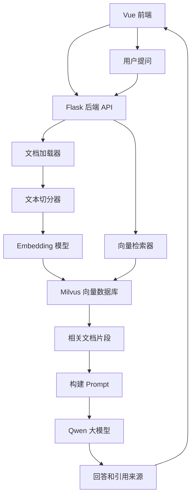

# RAG 私有知识库项目学习文档

面向对象：想学习向量数据库、文档问答、企业知识库和 RAG 应用开发的初学者。  
项目位置：`/Users/zhangchen/Desktop/example/vector_databases`

## 1. 这个项目学什么

这个项目是四个项目里最接近完整产品形态的一个。它实现了一个私有知识库问答系统：

1. 用户在前端上传文档。
2. 后端读取文档内容。
3. 系统把文档切成小块。
4. 系统把文本块转成向量。
5. 向量写入 Milvus 数据库。
6. 用户提问时，系统先检索相关文档块。
7. 系统把相关文档作为上下文交给大模型。
8. 大模型基于上下文生成回答。
9. 前端展示回答和引用来源。

这就是典型的 RAG 系统。

学完这个项目，你应该能理解：

- RAG 是什么，为什么它能减少大模型幻觉。
- Embedding 是什么，为什么文本可以变成向量。
- Milvus 向量数据库负责什么。
- 文档为什么要切分。
- Top-K、相似度阈值、chunk size 对回答质量有什么影响。
- Flask 后端如何提供上传、检索、问答接口。
- Vue 前端如何做文件上传、聊天和引用展示。

## 2. RAG 是什么

RAG 是 Retrieval-Augmented Generation，中文一般叫检索增强生成。

普通大模型问答是：

```text
用户问题 -> 大模型 -> 回答
```

RAG 问答是：

```text
用户问题 -> 检索知识库 -> 找到相关资料 -> 大模型基于资料回答
```

为什么需要 RAG？

因为大模型有三个常见问题：

- 不知道你的私有文档。
- 训练知识可能过时。
- 不知道答案时可能编造。

RAG 相当于让模型“开卷考试”。用户提问时，系统先从你的文档里找资料，再把资料和问题一起交给模型。模型不是凭空回答，而是参考资料回答。

## 3. 项目文件说明

| 文件或目录 | 作用 |
| --- | --- |
| `PROJECT_DOCS.md` | 项目说明文档，介绍整体架构和核心概念 |
| `vector_db_manager.py` | 向量数据库管理器，负责文档加载、切分、向量化、写入 Milvus、检索 |
| `vector_retriever.py` | RAG 检索问答模块，负责相似度搜索、构建上下文、调用大模型回答 |
| `document_loader.py` | 文档加载器，支持 TXT、CSV、PDF、DOCX、Excel 等格式 |
| `api_integration.py` | Flask API 蓝图，提供上传、查询、搜索、集合信息等接口 |
| `server.py` | Flask 后端入口 |
| `upload_document.py` | 命令行上传文档到 Milvus 的简化脚本 |
| `query_system.py` | 命令行向量检索和问答脚本 |
| `rag_front` | Vue3 前端项目 |
| `rag.txt` | 示例文档 |
| `test` | Milvus 测试脚本 |

推荐学习顺序：

1. 先读 `PROJECT_DOCS.md`，理解整体概念。
2. 再读 `upload_document.py`，理解最小入库流程。
3. 再读 `query_system.py`，理解最小查询流程。
4. 然后读 `vector_db_manager.py` 和 `vector_retriever.py`。
5. 最后读 `api_integration.py`、`server.py` 和前端 `RagChat.vue`。

## 4. 整体架构



这个项目有两条主链路：

- 入库链路：文档上传 -> 文档解析 -> 文本切分 -> 向量化 -> 写入 Milvus。
- 问答链路：用户提问 -> 向量检索 -> 构建上下文 -> LLM 生成回答 -> 返回来源。

理解这两条链路，就理解了 RAG 系统的核心。

## 5. 核心概念讲解

### 5.1 文档加载

用户上传的文件可能是 PDF、Word、TXT、CSV 或 Excel。程序不能直接把文件丢给大模型，需要先解析出文本。

项目里 `document_loader.py` 支持：

- `.txt`
- `.csv`
- `.pdf`
- `.docx`
- `.doc`
- `.xlsx`
- `.xls`

例如 PDF 使用：

```python
loader = PyPDFLoader(file_path)
documents = loader.load()
```

Word 使用：

```python
loader = Docx2txtLoader(file_path)
documents = loader.load()
```

每个加载器都会返回 `Document` 对象。`Document` 通常包含：

- `page_content`：文本内容。
- `metadata`：元数据，例如文件名、页码、来源路径。

### 5.2 文本切分

为什么要切分？

因为一个文档可能很长，不能全部塞给模型，也不适合整体向量化。

项目里使用：

```python
self.text_splitter = RecursiveCharacterTextSplitter(
    chunk_size=500,
    chunk_overlap=50,
    length_function=len,
    separators=["\n\n", "\n", "。", "！", "？", "；", "，", " ", ""]
)
```

参数解释：

- `chunk_size=500`：每个文本块大约 500 字符。
- `chunk_overlap=50`：相邻块之间重叠 50 字符。
- `separators`：优先按段落、换行、句号、逗号等切分。

为什么要有 overlap？

因为一句重要信息可能刚好跨越两个块。如果完全无重叠，检索时可能丢上下文。重叠能提高语义连续性。

### 5.3 Embedding

Embedding 是把文本变成数字向量。

例如：

```text
"Milvus 是向量数据库"
```

会被模型转换成类似：

```text
[0.12, -0.08, 0.33, ...]
```

真实向量通常有几百到几千维。

项目里使用 DashScope Embedding：

```python
self.embeddings = DashScopeEmbeddings(
    model=self.embedding_model,
    dashscope_api_key=self.dashscope_api_key
)
```

Embedding 的意义是：语义相近的文本，向量距离也更近。用户提问时，也会被转成向量，然后和数据库里的文档向量比较相似度。

### 5.4 Milvus

Milvus 是向量数据库。它不像 MySQL 那样主要查精确字段，而是擅长查“语义相似”。

普通数据库查询：

```sql
SELECT * FROM docs WHERE title = 'RAG'
```

向量数据库查询：

```text
找出和“什么是检索增强生成”语义最相近的 5 个文本块
```

项目默认连接：

```text
host=127.0.0.1
port=19530
collection=agent_rag
```

Collection 可以理解成 Milvus 里的表。一个知识库可以对应一个 Collection。

### 5.5 Top-K

Top-K 表示检索返回最相关的前 K 个文档块。

项目里常见设置是：

```python
k = 5
```

K 太小，可能漏掉重要资料。  
K 太大，可能引入噪音，还会增加模型 token 消耗。

初学阶段建议从 3 到 5 开始调试。

### 5.6 相似度阈值

`vector_retriever.py` 中有：

```python
similarity_threshold: float = 0.5
```

它用于过滤低质量结果。

如果检索结果分数低，说明知识库里可能没有相关资料。此时不应该强行把无关资料塞给模型，否则模型可能答偏。

## 6. 入库流程详解

入库流程由 `vector_db_manager.py` 负责。

### 6.1 初始化向量数据库管理器

```python
class VectorDatabaseManager:
    def __init__(
        self,
        milvus_host: str = None,
        milvus_port: int = None,
        collection_name: str = None,
        embedding_model: str = None,
        dashscope_api_key: str = None,
        chunk_size: int = 500,
        chunk_overlap: int = 50
    ):
```

这个类初始化时会做几件事：

1. 读取 Milvus 地址。
2. 读取 Collection 名称。
3. 初始化 Embedding 模型。
4. 初始化文本切分器。
5. 连接 Milvus。

### 6.2 加载文档

```python
def load_document(self, file_path: str) -> List[Document]:
```

它根据文件后缀选择加载器：

```python
if file_extension == '.txt':
    loader = TextLoader(file_path, encoding='utf-8')
elif file_extension == '.csv':
    loader = CSVLoader(file_path, encoding='utf-8')
elif file_extension == '.pdf':
    loader = PyPDFLoader(file_path)
elif file_extension in ['.docx', '.doc']:
    loader = Docx2txtLoader(file_path)
elif file_extension in ['.xlsx', '.xls']:
    loader = UnstructuredExcelLoader(file_path)
```

这一步的输出是原始 `Document` 列表。

### 6.3 切分文档

```python
def split_documents(self, documents: List[Document]) -> List[Document]:
    split_docs = self.text_splitter.split_documents(documents)
    return split_docs
```

输入可能是几页文档，输出可能是几十个或几百个文本块。

### 6.4 写入 Milvus

```python
def add_documents_to_db(self, documents: List[Document], collection_name: str = None):
```

这个函数有两个场景：

第一种：Collection 已存在。

```python
self.vectorstore = Milvus(
    embedding_function=self.embeddings,
    collection_name=target_collection,
    connection_args={"host": self.milvus_host, "port": self.milvus_port}
)
self.vectorstore.add_documents(documents)
```

第二种：Collection 不存在。

```python
self.vectorstore = Milvus.from_documents(
    documents=documents,
    embedding=self.embeddings,
    collection_name=target_collection,
    connection_args={"host": self.milvus_host, "port": self.milvus_port},
    drop_old=False
)
```

初学者要理解：`from_documents` 不只是插入数据，它还会帮助创建 Collection。

### 6.5 完整处理文件

项目把完整流程封装成：

```python
def process_file(self, file_path: str, collection_name: str = None) -> bool:
    documents = self.load_document(file_path)
    split_docs = self.split_documents(documents)
    self.add_documents_to_db(split_docs, collection_name)
    return True
```

这就是入库链路的核心：

```text
文件路径 -> 文档加载 -> 文本切分 -> 向量化写入 Milvus
```

## 7. 查询和问答流程详解

问答流程由 `vector_retriever.py` 负责。

### 7.1 相似度搜索

```python
def search_similar_content(
    self,
    query: str,
    collection_name: str,
    k: int = None,
    filter_expression: str = None,
    include_scores: bool = True
):
```

它调用：

```python
search_results = self.db_manager.search(query=query, k=k, collection_name=collection_name)
```

`search` 内部会做：

1. 把用户问题转成向量。
2. 在 Milvus 中搜索相似向量。
3. 返回文档和分数。

然后再过滤低分结果：

```python
for doc, score in search_results:
    if score >= self.similarity_threshold:
        results.append((doc, score))
```

### 7.2 构建上下文

```python
context_parts = []

for i, (doc, score) in enumerate(relevant_docs_with_scores):
    context_parts.append(f"参考资料{i+1}: {doc.page_content}")
```

把多个文档块拼成：

```text
参考资料1: ...

参考资料2: ...

参考资料3: ...
```

这段文本会作为上下文提供给大模型。

### 7.3 调用大模型回答

```python
answer = self._generate_answer_with_llm(question, context)
```

系统提示词是：

```text
你是一个智能助手。请基于提供的【参考资料】回答用户的问题。
如果参考资料为空或与问题无关，请忽略参考资料，利用你的通用知识进行回答，
并在回答开头说明：'知识库中未找到相关内容，以下是基于通用知识的回答：'。
回答要简洁、准确、有条理。
```

这个提示词很重要，因为它告诉模型：

- 有资料时基于资料回答。
- 没资料时要说明不是来自知识库。
- 不要假装知识库里有答案。

### 7.4 返回答案结果

```python
return AnswerResult(
    answer=answer,
    confidence=confidence,
    question_type=question_type,
    source_documents=source_documents,
    scores=scores
)
```

结果不仅有答案，还有：

- 置信度。
- 问题类型。
- 引用文档。
- 相似度分数。

这就是前端能展示“参考依据”的原因。

## 8. Flask API 详解

后端入口是 `server.py`。

```python
def create_app():
    app = Flask(__name__)
    CORS(app)
    register_vector_routes(app)
    return app
```

真正的接口在 `api_integration.py`。

### 8.1 初始化向量系统

```python
def init_vector_system(...):
    vector_manager = VectorDatabaseManager(...)
    vector_retriever = VectorRetriever(vector_manager)
```

Flask 启动时会自动初始化：

```python
with app.app_context():
    init_vector_system()
```

### 8.2 上传文件接口

接口：

```text
POST /api/vector/upload_file
```

前端传：

- `file`：上传文件。
- `collection_name`：Collection 名称。

后端逻辑：

```python
file = request.files['file']
collection_name = request.form.get('collection_name', 'agent_rag')
file.save(file_path)
success = vector_manager.process_file(file_path, collection_name)
```

这就是前端上传文档后触发入库的入口。

### 8.3 问答接口

接口：

```text
POST /api/vector/query
```

请求内容：

```json
{
  "question": "Milvus 是什么？",
  "collection_name": "agent_rag"
}
```

后端调用：

```python
result = vector_retriever.answer_question(
    question,
    k=k,
    collection_name=collection_name
)
```

返回：

```json
{
  "success": true,
  "answer": "...",
  "confidence": 0.82,
  "sources": [
    {
      "content": "...",
      "metadata": {},
      "score": 0.76
    }
  ]
}
```

### 8.4 相似搜索接口

接口：

```text
POST /api/vector/search
```

它只返回检索结果，不调用大模型生成最终回答。适合调试检索质量。

### 8.5 集合信息接口

接口：

```text
GET /api/vector/collection_info?collection_name=agent_rag
```

用于查看 Collection 是否存在、文档数量等信息。

## 9. Vue 前端详解

前端核心文件：

```text
rag_front/src/components/RagChat.vue
```

它实现了一个完整的知识库问答界面：

- 左侧上传文档。
- 设置 Collection 名称。
- 点击解析入库。
- 右侧聊天问答。
- 展示回答。
- 展示引用来源和相似度。

### 9.1 上传文件

前端使用 Element Plus 的上传组件：

```vue
<el-upload
  drag
  action="#"
  :auto-upload="false"
  :on-change="handleFileChange"
>
```

注意这里 `auto-upload=false`，表示选择文件后不自动上传，而是点击按钮时手动提交。

提交逻辑：

```javascript
const formData = new FormData()
formData.append('file', fileToUpload.value)
formData.append('collection_name', collectionName.value)

await axios.post(`${API_BASE}/upload_file`, formData, {
  headers: { 'Content-Type': 'multipart/form-data' }
})
```

### 9.2 发送问题

```javascript
const response = await axios.post(`${API_BASE}/query`, {
  question: query,
  collection_name: collectionName.value
})
```

后端返回成功后：

```javascript
messages.value.push({
  role: 'assistant',
  content: response.data.answer,
  sources: response.data.sources,
  showSources: false
})
```

### 9.3 引用来源展示

前端展示每条来源：

```vue
<span class="score">相似度: {{ (source.score * 100).toFixed(1) }}%</span>
<div class="source-text">{{ source.content }}</div>
```

这对 RAG 系统非常重要。用户不只要看到答案，还要知道答案来自哪里。

## 10. 命令行脚本的学习价值

这个项目还有两个简化脚本，适合初学者单独理解核心流程。

### 10.1 `upload_document.py`

它演示最小入库流程：

```text
连接 Milvus
创建 Collection
加载文件
切分文本
生成 Embedding
插入 Milvus
```

这个脚本比 Flask 后端更简单，适合用来理解底层原理。

### 10.2 `query_system.py`

它演示最小查询流程：

```text
连接 Milvus
解析 Collection Schema
把问题转成向量
搜索相似文本
构建上下文
调用 Qwen 回答
返回答案、上下文和日志
```

它还有一个很好的设计：保留 `_trace_logs`，记录每个阶段发生了什么，方便调试。

## 11. 运行方式

### 11.1 准备环境变量

项目需要 `.env`：

```text
DASHSCOPE_API_KEY=你的 DashScope Key
MILVUS_HOST=127.0.0.1
MILVUS_PORT=19530
COLLECTION_NAME=agent_rag
EMBEDDING_MODEL=text-embedding-v1
LLM_BASE_URL=https://dashscope.aliyuncs.com/compatible-mode/v1
LLM_MODEL=qwen-plus
```

### 11.2 启动 Milvus

项目文档提到 Milvus 默认地址：

```text
localhost:19530
```

MinIO 管理界面：

```text
http://localhost:9001
```

账号密码默认：

```text
minioadmin / minioadmin
```

如果没有启动 Milvus，后端初始化会失败。

### 11.3 启动 Flask 后端

```bash
cd /Users/zhangchen/Desktop/example/vector_databases
python server.py
```

默认服务：

```text
http://localhost:5000
```

API 前缀：

```text
http://localhost:5000/api/vector
```

### 11.4 启动 Vue 前端

```bash
cd /Users/zhangchen/Desktop/example/vector_databases/rag_front
npm install
npm run dev
```

前端默认请求：

```text
http://localhost:5000/api/vector
```

## 12. 调试 RAG 质量的方法

### 12.1 先调检索，再调回答

不要一开始就看最终回答。应该先调用 `/search` 接口，看检索出来的文档块是否相关。

如果检索结果不相关，大模型再强也很难答好。

### 12.2 检查 chunk size

如果 chunk 太小：

- 上下文不完整。
- 一句话可能被切断。
- 检索结果碎片化。

如果 chunk 太大：

- 向量语义不够聚焦。
- 每次传给模型的上下文过长。
- 噪音更多。

初学可以从 500 字符开始，根据文档类型调整。

### 12.3 检查 Top-K

如果答案缺信息，可以增大 K。  
如果答案混入无关内容，可以减小 K。

### 12.4 检查相似度阈值

阈值过高可能检索不到内容。  
阈值过低可能把无关内容传给模型。

### 12.5 检查 Prompt

RAG Prompt 要明确：

- 只能基于参考资料回答。
- 资料不足时要说明。
- 尽量引用来源。
- 不要编造。

## 13. 常见问题和排查

### 13.1 上传成功但问不到答案

可能原因：

- 文档解析出来的内容为空。
- 文档切分过碎或过大。
- Embedding 写入失败。
- Collection 名称不一致。
- 查询时使用了另一个 Collection。

排查方法：

- 调用 `collection_info` 看文档数量。
- 调用 `/search` 看是否能搜到相关文本。
- 检查前端当前 Collection 名称。

### 13.2 Milvus 连接失败

可能原因：

- Milvus 没启动。
- 端口不是 19530。
- Docker 服务异常。
- 环境变量配置错。

排查方法：

- 检查 Milvus 容器状态。
- 确认 `MILVUS_HOST` 和 `MILVUS_PORT`。
- 用测试脚本连接 Milvus。

### 13.3 Schema 不兼容

项目里已经处理了一类 Schema 不兼容错误：

```python
if "non-exist field" in msg or "inconsistent with defined schema" in msg:
    utility.drop_collection(target_collection)
    Milvus.from_documents(...)
```

这说明 Collection 结构和当前写入方式不匹配。

学习阶段可以删除 Collection 重建。  
生产环境不能随便删除，需要做迁移或新建 Collection。

### 13.4 LLM 生成失败

可能原因：

- `DASHSCOPE_API_KEY` 未配置。
- `LLM_BASE_URL` 错误。
- 模型名错误。
- 网络不可用。
- API 额度不足。

排查方法：

- 单独调用一次 Qwen 测试。
- 检查后端日志。
- 检查 `.env` 是否被正确加载。

### 13.5 前端上传失败

可能原因：

- Flask 后端没启动。
- CORS 问题。
- 文件太大。
- 文件类型不支持。
- 后端临时目录没有权限。

排查方法：

- 浏览器开发者工具看 Network。
- 后端日志看具体异常。
- 先用 TXT 小文件测试。

## 14. 这个项目的挑战点

第一，文档解析复杂。不同文件格式差异很大，PDF 可能有乱码，Excel 可能有多表格，CSV 可能有编码问题。

第二，切分策略影响大。chunk size、overlap、分隔符都会影响召回质量。

第三，Embedding 和 Milvus 要匹配。向量维度、Collection Schema、索引类型、距离度量都要一致。

第四，检索质量决定回答质量。RAG 的核心不是让模型“自由发挥”，而是先找到正确资料。

第五，Prompt 约束很重要。模型必须知道什么时候基于资料回答，什么时候说明资料不足。

第六，前后端链路长。上传、入库、检索、回答、引用展示，每一步都要处理错误。

第七，生产安全更复杂。上传文件要限制大小和类型，临时文件要清理，Collection 删除要谨慎，API Key 不能泄露。

## 15. 初学者练习任务

### 练习 1：用 TXT 文件跑通完整流程

目标：上传一个小 TXT 文件，然后提问。

建议文档内容：

```text
公司报销规则：员工需要在每月 5 日前提交报销单。超过 5 日提交的报销会顺延到下个月处理。
```

问题：

```text
报销单最晚什么时候提交？
```

观察回答是否引用了文档内容。

### 练习 2：调试 `/search` 接口

目标：不调用大模型，只看检索结果。

请求：

```json
{
  "query": "报销提交时间",
  "collection_name": "agent_rag",
  "k": 5
}
```

观察返回的 `content` 是否相关。

### 练习 3：调整 chunk size

目标：把 `chunk_size` 从 500 改成 200 和 1000，比较检索结果。

思考：

- 哪种更容易搜到完整答案？
- 哪种更容易带入无关内容？

### 练习 4：前端显示文件名

目标：在引用来源里显示 `metadata.file_name`。

这样用户不仅能看到引用内容，还能知道来自哪个文件。

### 练习 5：增加删除 Collection 的确认

目标：如果前端未来支持清空集合，必须二次确认。

原因：清空 Collection 会删除知识库数据，属于高风险操作。

## 16. 从这个项目继续进阶

学完这个项目后，可以继续扩展：

- 支持多文件批量上传。
- 支持用户级知识库隔离。
- 支持混合检索，结合关键词搜索和向量搜索。
- 支持重排序模型，对检索结果二次排序。
- 支持引用页码和文档下载链接。
- 支持后台任务队列，避免大文件上传阻塞请求。
- 支持权限控制，不同用户只能查自己的文档。
- 支持评测集，定期评估 RAG 回答质量。

## 17. 学习总结

这个 RAG 项目是 AI 应用开发里非常重要的一类项目。它把大模型、文档解析、向量数据库、后端 API 和前端应用串成了一条完整链路。

你需要记住：

- RAG 的关键是先检索，再生成。
- 文档必须先加载、切分、向量化，才能被检索。
- Milvus 负责存储和搜索向量。
- Embedding 决定语义表示质量。
- Prompt 决定模型如何使用检索结果。
- 前端展示引用来源能提升可信度。

如果你能独立讲清楚“上传一个 PDF 后，用户提问时系统发生了什么”，就说明你已经真正理解了这个项目。

## 18. 教学增强：RAG 系统的五层结构

为了让初学者真正理解 RAG，可以把系统拆成五层。

```text
第一层：数据层
第二层：向量层
第三层：检索层
第四层：生成层
第五层：应用层
```

### 18.1 数据层

数据层负责把各种文件变成纯文本。

输入：

```text
PDF、Word、TXT、CSV、Excel
```

输出：

```text
Document(page_content="...", metadata={...})
```

这一层最常见的问题是：

- PDF 解析乱码。
- 表格结构丢失。
- 扫描版 PDF 没有文本。
- 文件编码不对。
- 文档里有很多页眉页脚噪音。

### 18.2 向量层

向量层负责把文本变成向量，并存入 Milvus。

输入：

```text
文本块
```

输出：

```text
向量 + 原文 + 元数据
```

这一层最常见的问题是：

- Embedding API Key 错误。
- 向量维度和 Collection Schema 不匹配。
- Collection 已存在但字段结构不同。
- 插入后没有 flush 或 load。

### 18.3 检索层

检索层负责根据问题找到相关文本块。

输入：

```text
用户问题
```

输出：

```text
Top-K 相关文档块
```

这一层最常见的问题是：

- 搜不到。
- 搜到无关内容。
- 分数看起来不直观。
- K 值不合适。
- chunk 太大或太小。

### 18.4 生成层

生成层负责把问题和上下文交给大模型，生成答案。

输入：

```text
问题 + 检索上下文
```

输出：

```text
自然语言回答
```

这一层最常见的问题是：

- 模型编造。
- 模型没有引用来源。
- 上下文太长。
- 上下文和问题无关。
- Prompt 约束不够明确。

### 18.5 应用层

应用层负责让用户能用起来。

包括：

- 文件上传。
- 集合名称配置。
- 聊天界面。
- 加载状态。
- 错误提示。
- 来源展示。

这一层最常见的问题是：

- 前后端接口不一致。
- CORS 报错。
- 上传进度不明显。
- 后端失败但前端提示不清楚。
- 引用来源展示不友好。

## 19. 文档入库细节：从文件到向量

这一节适合课堂上逐步画图讲。

### 19.1 原始文档

用户上传一个 PDF：

```text
员工手册.pdf
```

里面可能有：

```text
第一章 考勤制度
第二章 报销制度
第三章 请假制度
```

系统不能直接把整个 PDF 存到 Milvus。Milvus 存的是向量，不是 PDF 文件本身。

### 19.2 文档加载

`PyPDFLoader` 会把 PDF 读成多个 Document。

可能得到：

```python
[
    Document(page_content="第一页内容...", metadata={"page": 0, "source": "员工手册.pdf"}),
    Document(page_content="第二页内容...", metadata={"page": 1, "source": "员工手册.pdf"})
]
```

这里 metadata 非常重要。后面展示引用来源时，需要知道答案来自哪个文件、哪一页。

### 19.3 文本清洗

这个项目里的清洗比较基础。真实项目可能还要做：

- 去掉页眉页脚。
- 去掉连续空格。
- 去掉乱码字符。
- 合并断行。
- 保留标题层级。
- 表格转 Markdown。

例如 PDF 里可能解析成：

```text
报
销
流
程
```

这会影响 embedding 效果，需要清洗成：

```text
报销流程
```

### 19.4 文本切分

假设原文：

```text
公司报销规则：员工需要在每月5日前提交报销单。超过5日提交的报销会顺延到下个月处理。报销材料包括发票、审批单和付款凭证。
```

如果 chunk size 合适，可能切成：

```text
块1：公司报销规则：员工需要在每月5日前提交报销单。超过5日提交的报销会顺延到下个月处理。
块2：超过5日提交的报销会顺延到下个月处理。报销材料包括发票、审批单和付款凭证。
```

注意块 1 和块 2 有重叠。这样“超过5日提交”这个关键信息不会因为切分而丢失上下文。

### 19.5 向量化

每个文本块调用 Embedding 模型。

```python
embedding = embeddings.embed_documents([chunk_text])
```

得到向量后，系统会存：

```text
id
text
embedding
metadata
```

### 19.6 写入 Milvus

Milvus 保存的不是“一个文件”，而是一批文本块。

一个 10 页 PDF 可能切成 80 个 chunk。Milvus 里就是 80 条记录。

所以 Collection 里的 `document_count` 更准确地说是“文本块数量”，不一定是原始文件数量。

## 20. 检索细节：从问题到相关文本

用户问：

```text
报销单最晚什么时候提交？
```

系统不会直接用关键词查“报销单”。它会先把问题转成向量。

### 20.1 查询向量化

```python
query_vector = embedding_model.embed_query("报销单最晚什么时候提交？")
```

这个向量表达的是问题的语义。

### 20.2 相似度搜索

Milvus 会比较：

```text
问题向量 vs 所有文档块向量
```

找到最接近的几个。

可能返回：

```text
Top1：员工需要在每月5日前提交报销单。score=0.82
Top2：报销材料包括发票、审批单和付款凭证。score=0.61
Top3：请假需要提前申请。score=0.33
```

如果相似度阈值是 0.5，Top3 会被过滤掉。

### 20.3 检索结果为什么会错

检索错误通常不是模型生成的问题，而是前面的数据问题。

常见原因：

- 文档里根本没有答案。
- 文档解析出来的文本质量差。
- 切分把答案拆散了。
- Embedding 模型不适合当前语言或领域。
- 用户问题太模糊。
- Top-K 太小。
- 阈值太高。

所以调 RAG，第一步不是改 Prompt，而是看检索结果。

## 21. Prompt 细节：如何减少幻觉

RAG Prompt 的目标不是让模型“更会发挥”，而是让它“更守规矩”。

### 21.1 一个不好的 Prompt

```text
请回答用户问题。
```

问题：

- 没说要基于资料。
- 没说资料不足怎么办。
- 没说是否要引用。
- 模型容易自由发挥。

### 21.2 一个更好的 Prompt

```text
你是一个企业知识库问答助手。
请仅基于【参考资料】回答用户问题。
如果参考资料中没有答案，请明确说明“知识库中未找到相关内容”。
不要编造制度、金额、日期、流程。
回答时尽量分点说明。
如果可以，请指出答案依据来自哪段资料。
```

这类 Prompt 有几个关键约束：

- 限定身份。
- 限定信息来源。
- 明确资料不足时的行为。
- 禁止编造。
- 要求结构化回答。

### 21.3 为什么仍然不能完全避免幻觉

即使 Prompt 写得好，模型仍可能犯错。

原因：

- 检索上下文本身不相关。
- 上下文有冲突。
- 用户问题要求推理但资料不足。
- 模型忽略部分约束。

所以真实项目还需要：

- 引用来源。
- 置信度。
- 人工反馈。
- 评测集。
- 高风险问题拒答。

## 22. Milvus 细节：Collection、Schema、Index

初学者经常只知道 Milvus 是向量数据库，但不知道里面有什么。

### 22.1 Collection

Collection 类似数据库表。

例如：

```text
agent_rag
```

一个 Collection 里存很多向量记录。

可以按业务设计多个 Collection：

```text
hr_docs
finance_docs
tech_docs
sales_docs
```

也可以按用户设计：

```text
user_001_docs
user_002_docs
```

但 Collection 太多也会增加管理成本。

### 22.2 Schema

Schema 定义每条记录有哪些字段。

简化理解：

```text
id: 主键
text: 原文
embedding: 向量
metadata: 元数据
```

如果之前创建过 Collection，但字段和现在代码不一致，就会出现 Schema 不兼容。

### 22.3 Vector Field

向量字段通常叫：

```text
embedding
vector
```

查询时必须知道哪个字段是向量字段。

`query_system.py` 里有一段动态解析字段：

```python
vector_fields = [f.name for f in fields if getattr(f, "dtype", None) == DataType.FLOAT_VECTOR]
```

这比写死字段名更稳。

### 22.4 Index

向量数据库为了快速搜索，会建立索引。

项目简化脚本里使用：

```python
index_params = {
    "index_type": "AUTOINDEX",
    "metric_type": "L2",
    "params": {}
}
```

初学阶段记住：

- Index 是为了加速搜索。
- metric_type 是距离计算方式。
- L2 表示欧式距离。
- 生产环境要根据数据量和模型选择索引类型。

## 23. 参数调优详细指南

RAG 效果不好时，常常是参数需要调。

### 23.1 chunk_size

推荐起点：

| 文档类型 | 推荐 chunk_size |
| --- | --- |
| FAQ | 200-400 |
| 制度文档 | 400-800 |
| 技术文档 | 500-1000 |
| 长报告 | 800-1200 |

判断标准：

- 一个 chunk 能不能包含完整语义。
- 检索结果是不是过碎。
- 模型上下文是不是太长。

### 23.2 chunk_overlap

推荐起点：

```text
chunk_size 的 10%-20%
```

例如：

```text
chunk_size=500
chunk_overlap=50
```

overlap 太小会丢上下文。  
overlap 太大会产生大量重复内容。

### 23.3 top_k

推荐：

```text
3 到 5
```

如果问题需要综合多个段落，可以增大到 8 或 10。  
如果文档很噪，K 太大会降低回答质量。

### 23.4 similarity_threshold

阈值不是绝对的，因为不同距离度量和库返回分数含义可能不同。

调试方法：

1. 准备 10 个已知答案的问题。
2. 打印每个问题的 Top-K 分数。
3. 观察相关和不相关结果的分数分布。
4. 再确定阈值。

不要凭感觉随便设。

### 23.5 temperature

RAG 问答建议 temperature 较低：

```text
0.1 - 0.4
```

因为知识库问答更需要准确，不需要太多创造性。

项目里有些地方用 `0.7`，教学可以保留，但真实知识库问答建议调低。

## 24. RAG 质量评估方法

一个 RAG 系统不能只靠“感觉还行”判断质量。

可以从四个维度评估。

### 24.1 召回是否正确

问题：

```text
报销单最晚什么时候提交？
```

检索结果是否包含：

```text
每月5日前提交报销单
```

如果没有，说明检索层失败。

### 24.2 回答是否忠实

如果文档说：

```text
每月5日前
```

模型回答：

```text
每月10日前
```

这就是不忠实。

### 24.3 引用是否正确

回答引用的来源是否真的支持这个结论。

如果引用段落讲的是请假制度，却回答报销规则，说明引用错误。

### 24.4 用户体验是否清楚

包括：

- 答案是否简洁。
- 是否有条理。
- 找不到答案时是否明确说明。
- 是否展示来源。
- 错误提示是否可理解。

## 25. 课堂实验设计

### 实验 1：构造一个小知识库

创建 `company_policy.txt`：

```text
公司考勤制度：员工每天上午9点前到岗，下午6点后下班。
公司报销制度：员工需要在每月5日前提交报销单。
公司请假制度：请假需要提前2个工作日提交申请。
```

上传后提问：

```text
请假要提前多久申请？
报销单什么时候提交？
几点上班？
```

目标：让学生跑通完整链路。

### 实验 2：观察检索错误

提问：

```text
公司年终奖怎么发？
```

知识库没有答案。

观察系统是否会明确说明没有相关内容。

### 实验 3：改变 chunk_size

把 chunk_size 改小，再重新入库，观察检索结果。

目标：理解切分对检索质量的影响。

### 实验 4：增加引用展示

让前端显示：

```text
文件名
页码
相似度
引用片段
```

目标：理解可信 RAG 不只是回答，还要能追溯。

## 26. 生产化改造清单

如果这个项目要从教学 Demo 变成企业应用，需要补很多能力。

### 26.1 文件上传安全

需要限制：

- 文件大小。
- 文件类型。
- 文件数量。
- 文件名安全。
- 病毒扫描。
- 临时文件清理。

### 26.2 异步任务

大文件入库可能很慢，不适合在 HTTP 请求里同步完成。

生产方案：

```text
上传文件 -> 创建任务 -> 后台队列处理 -> 前端轮询任务状态
```

可以使用：

- Celery。
- RQ。
- FastAPI BackgroundTasks。
- 消息队列。

### 26.3 用户权限

不同用户只能查自己的文档。

需要设计：

- 用户 ID。
- Collection 隔离。
- 文档权限。
- 查询鉴权。

### 26.4 数据更新和删除

教学项目重点是新增文档。真实项目还要支持：

- 删除文档。
- 更新文档。
- 重新切分。
- 删除对应向量。
- 保留版本历史。

### 26.5 监控和日志

需要记录：

- 上传了什么文件。
- 切了多少块。
- Embedding 是否成功。
- 检索 Top-K 是什么。
- 模型回答是什么。
- 用户是否点赞或点踩。

这些日志用于持续优化。

### 26.6 成本控制

RAG 系统会消耗：

- Embedding 调用费用。
- LLM 调用费用。
- 向量数据库资源。
- 存储资源。

优化方式：

- 文档去重。
- 缓存常见问题。
- 控制 Top-K。
- 控制上下文长度。
- 低价值文档不入库。

## 27. 如何把这个项目讲成简历项目

简历写法：

```text
基于 Flask、Vue3、LangChain、DashScope Embedding、Qwen 和 Milvus 构建企业级 RAG 私有知识库问答系统，实现文档上传、自动解析、文本切分、向量化入库、相似度检索、上下文增强生成和引用来源展示；后端提供上传、搜索、问答和集合信息 API，前端支持文档拖拽上传、Collection 配置、聊天问答和参考依据折叠展示；通过 Top-K、相似度阈值、chunk size 和 Prompt 约束优化回答准确性与可追溯性。
```

可强调亮点：

- 完整 RAG 链路。
- 多格式文档解析。
- Milvus 向量数据库。
- DashScope Embedding。
- Qwen 生成回答。
- 前后端分离。
- 引用来源展示。
- 检索质量调试。

面试可能追问：

1. RAG 为什么能减少幻觉？
2. 文档为什么要切分？
3. chunk_size 怎么选择？
4. Embedding 的作用是什么？
5. Milvus 和 MySQL 的区别是什么？
6. Top-K 太大或太小有什么问题？
7. 如果检索不到答案，你怎么排查？
8. 如何保证模型只基于资料回答？
9. 引用来源如何实现？
10. 生产环境如何做权限隔离？

## 28. RAG 小测验

1. RAG 的三个核心步骤是什么？
2. Document 的 `page_content` 和 `metadata` 分别存什么？
3. 为什么不能直接把整本书作为一个 chunk？
4. Embedding 为什么能用于语义搜索？
5. Milvus Collection 类似传统数据库里的什么？
6. Top-K 的 K 应该越大越好吗？
7. 相似度阈值过高会有什么问题？
8. 如果检索结果不相关，应该优先改 Prompt 还是检查检索？
9. 为什么前端要展示引用来源？
10. 如果要支持多用户知识库，你会怎么设计 Collection？
